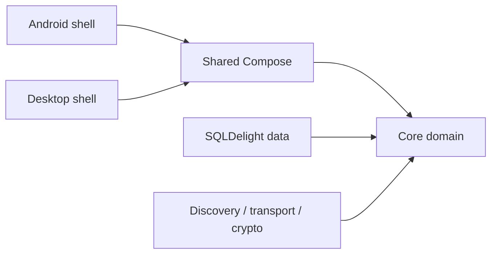

# SubnetDrop repository guidance

本文件约束本仓库后续开发。开始修改前先阅读本文件、`docs/ARCHITECTURE.md`、相关规格和
`docs/tasks/lessons.md`（若存在）。更具体的目录级 `AGENTS.md` 可以补充规则，但不得降低这里的安全与质量要求。

## Product boundary

- 产品是以加密文件直传为核心、兼具一对一即时聊天的开源局域网工具，支持 Android 11+、macOS 和 Windows。
- 正式 Gradle 模块只有 `:core`、`:data`、`:network`、`:app:shared`、`:app:androidApp` 和
  `:app:desktopApp`。不要重新引入旧模板、中心服务器、iOS 或 Web 目标，除非需求明确要求。
- 消息、文件和身份通信只发生在局域网受信设备之间，不引入云端转发、统计或第三方账号体系。
- 功能和协议入口分别见 `docs/spec/subnetdrop-v1.md` 与 `docs/spec/file-transfer-v1.md`。

## Architecture

依赖方向保持向内：



- `core` 只能包含纯 Kotlin 领域模型、端口和用例，不依赖 Compose、Koin、SQLDelight、Ktor 或平台 API。
- `data` 只负责持久化和领域仓库适配，不包含 UI、设备发现或网络协议逻辑。
- `network` 负责发现、配对、协议、加密和传输，通过 `core` 端口访问领域能力。
- `app/shared` 负责 Compose UI、ViewModel、运行时编排和 Koin 组合，不直接实现加密或数据库细节。
- 平台 API 放在对应的 `androidMain` 或 `jvmMain`；Android/JVM 共用代码放在现有 `jvmAndAndroidMain`。
- 新能力先定义领域模型和端口，再实现适配器，最后接入 ViewModel 与 UI。不要让 Composable 直接执行磁盘或网络 IO。

## Dependency injection

- 依赖注入统一使用 Koin，不引入 Hilt、Dagger 或 Service Locator。
- 公共仓库与用例在 `CommonModules.kt` 注册；文件选择、目录、密钥存储和发现服务等平台实现放平台 Module。
- 构造函数注入优先。禁止从领域层读取全局 Koin 容器。
- 单例只用于确有进程级状态的数据库、身份、发现和传输服务；无状态用例使用 `factory`。

## Kotlin and coroutine rules

- 4 空格缩进，UTF-8，单行不超过 120 字符；禁止通配导入。
- 类型使用 `PascalCase`，变量和函数使用 `camelCase`，常量使用 `UPPER_SNAKE_CASE`。
- 优先 `val`、不可变集合和 `copy` 更新；禁止 `!!`。
- 公共状态使用 `StateFlow`/`Flow` 暴露只读视图，不把可变 Flow 暴露给 UI。
- 捕获通用异常时必须先重新抛出 `CancellationException`，不吞错误，不用异常控制正常分支。
- 函数保持单一职责，通常不超过 50 行；超过 4 个相关参数时优先使用模型或配置对象。
- 禁止 `println`、裸 `android.util.Log`、硬编码密钥和无说明的 `TODO`。
- 注释只解释设计原因、约束和非显然不变量，不复述代码行为。

## Security and protocol invariants

- 未完成安全码核对的设备不能收发聊天内容或文件；密钥变化必须进入 `KEY_CHANGED` 并阻断通信。
- 聊天正文与文件内容必须保持端到端加密。身份响应、ACK 和已读回执必须验证签名与发送方/接收方。
- 加密载荷必须把协议版本、帧类型、发送方和接收方绑定到 associated data，防止跨帧重放。
- 所有外部输入都要限制长度、数量和格式；协议错误必须显式返回，不能静默降级成明文。
- 消息接收保持幂等；ACK、已读回执和文件块只能更新属于对应受信对端的数据。
- 文件传输必须先提议再确认，保持 24 KiB 有界分块、10 GiB 上限、严格顺序和最终 SHA-256 校验。
- 接收文件先写同目录临时文件；校验成功后再发布。拒绝、取消、失败和服务停止必须清理临时文件。
- 文件名必须去除路径语义并拒绝控制字符；任何情况下都不能覆盖已有文件。
- 私钥只进入 Android Keystore 或桌面系统密钥存储，不写 SQLite、日志、源码或示例配置。
- 当前 SQLite 聊天正文是本机明文数据。若要提升静态数据保护，应设计正式迁移，不能宣称现状已加密。

## SQLDelight and data evolution

- 查询使用参数绑定，禁止字符串拼接 SQL。
- 修改 schema 前检查现有安装数据库；新增表、列或约束必须提供并验证迁移路径。
- 数据库状态与网络状态分开建模。传输失败不能伪装成成功或用默认值覆盖真实状态。
- 持久化修改至少覆盖：首次建库、旧库升级、关闭重开后数据恢复。

## Compose UI

- 使用 Compose Multiplatform Material 3 和官方 Material Icons，不混入平台 XML UI。
- “附近设备 / 聊天 / 设置”保持底部主导航；桌面宽屏使用双栏，紧凑窗口使用单栏返回导航。
- 所有可能超出窗口高度的内容使用可滚动容器，并通过 `weight`/约束为列表提供有限高度。
- 图标按钮必须有中文 `contentDescription`；装饰图标才允许为 `null`。
- 聊天气泡、输入框和传输卡在窗口缩放后不能遮挡；聊天列表应始终可滚动。
- 耗时操作展示明确的等待、进度、成功或失败状态；危险操作不得依赖仅靠颜色表达。

## Build and dependencies

- 始终使用 Gradle Wrapper 9.1.0；完整命令见 `BUILD_GUILD.md`。
- 版本统一维护在 `gradle/libs.versions.toml`，禁止在模块中散落硬编码依赖版本。
- Google、Maven Central、Gradle 插件、Gradle 分发、Node 和 npm/Yarn 继续使用项目现有国内镜像。
- 不要为了临时下载成功而添加国外仓库或修改用户全局 Gradle/Codex/IDE 配置。
- 除非任务明确涉及 Android，默认验证 JVM/桌面任务；未经用户明确要求不得执行 Android 安装或 ADB 操作。
- 桌面原生安装包必须在目标系统构建：macOS 构建 DMG，Windows 构建 MSI。

## Workflow and verification

- 修改前先读当前文件、导入和相关调用方，复用现有模型与服务，避免平行实现。
- 非平凡功能先更新 `docs/tasks/todo.md`；涉及协议或架构时先更新 `docs/spec/` 和
  `docs/ARCHITECTURE.md`。
- 每个修复处理根因。发现同类补丁反复出现时暂停并调整设计，不继续堆条件分支。
- 只修改任务需要的内容，保留用户已有和已暂存变更，不做无关格式化。
- 完成前运行与风险匹配的最小测试集，并把命令、结果和必要截图写入 `docs/tasks/verification/`。
- 桌面功能的最低回归命令：

```shell
./gradlew :core:jvmTest :data:jvmTest :network:jvmTest :app:shared:jvmTest \
  :app:desktopApp:compileKotlin
```

- 协议、加密和文件传输变更必须运行：

```shell
./gradlew :network:jvmTest --tests ink.x2.subnetdrop.network.transport.SubnetDropTransportTest
```

- 不能证明成功时明确说明未验证部分。Windows MSI 和真实 Windows 互操作在 Windows 主机验证前不得标记完成。

## Git discipline

- 用户要求“根据暂存区生成 commit message / 提交信息”时，必须完整读取并遵守
  `.agents/skills/staged-commit-message/SKILL.md`。该 Skill 支持自动匹配，也可以通过
  `$staged-commit-message` 显式调用；它只读暂存区，只输出建议，不得提交、amend 或 push。
- 新环境先运行 `bash scripts/setup-git-hooks.sh`。日常提交使用 `git commit` 进入交互式 Conventional Commit
  构建器，提交格式为 `type(scope): subject`，不自动追加任务号或额外 footer。
- 未经明确要求不创建提交、不推送、不合并。
- 禁止 `--no-verify`、直接推送目标分支和 `git push --force`。
- 不修改、覆盖或清理与当前任务无关的工作区及暂存区内容。
