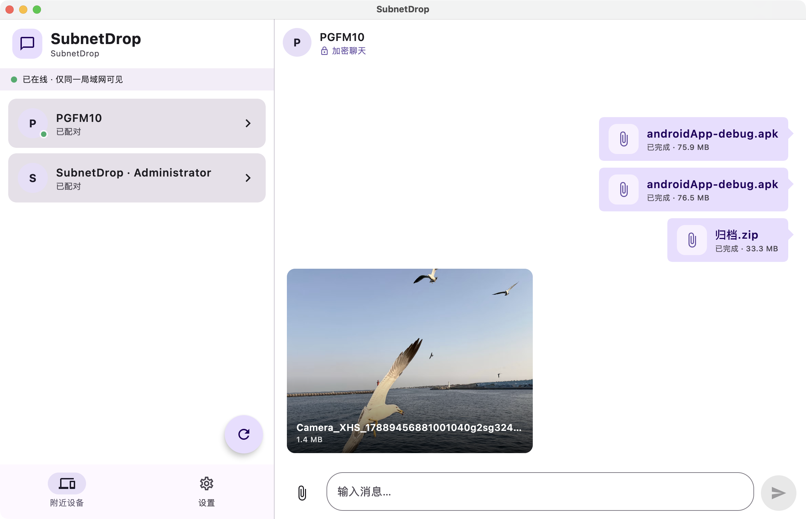
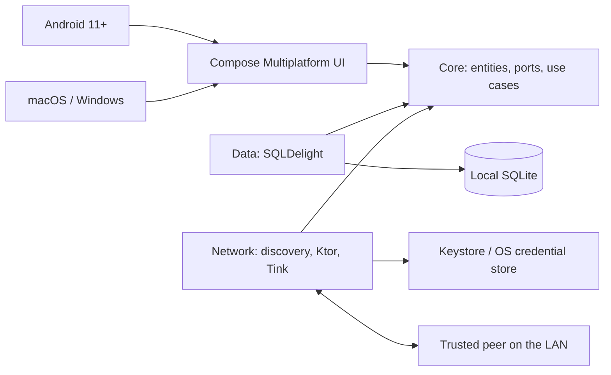

# SubnetDrop

> Serverless, high-speed file transfer and encrypted one-to-one chat for devices on the same LAN.

SubnetDrop 是一个面向 Android、macOS 和 Windows 的局域网直连应用。设备连接到同一个可互访的 Wi-Fi
后，通过 UDP 组播和 WebSocket 可达性探测自动发现彼此，核对安全码完成配对，并直接传输加密消息和高速文件。
通信不依赖互联网、云存储、
账号系统或中心服务器，聊天记录只保存在参与通信的本地设备中。



> 截图来自当前 macOS 构建；为避免在开源仓库暴露本机账户名，仅将设备名替换为中性的 `Desktop`。

## 产品亮点

- **同网即用**：设备主动发送 UDP 组播公告，再用 WebSocket `PING/PONG` 确认对端真实可达。
- **自动恢复在线**：保留已知设备端点并退避探测，启动竞态、组播丢包或 VPN 切换后无需重启即可恢复。
- **Android 后台传输**：使用 `connectedDevice` 前台 Service 持有局域网运行时，切换应用、锁屏或划掉最近任务时
  不主动中断发现和传输；通知栏同步展示单文件或多文件汇总进度，用户强制停止应用仍遵循系统行为终止连接。
- **隔离 VPN 默认路由**：发现会避开隧道虚拟网卡；Android 将局域网会话绑定到 Wi-Fi，避免跟随 VPN 默认路由。
- **无中心服务器**：每台设备既能监听也能主动连接，消息和文件直接在两端之间传输。
- **显式建立信任**：双方核对相同的六位安全码后才保存公钥；已配对设备密钥变化会进入阻断状态。
- **加密文字聊天**：Google Tink HPKE 保护聊天正文，Ed25519 认证发送者和文件控制帧。
- **可靠一对一聊天**：支持本地历史、文字与文件消息菜单、整条复制与部分选中、在线设备转发、本地删除、混合多选、
  失败重试、签名送达 ACK、未读计数和签名已读回执。
- **可控设备记录**：Android 长按、桌面右键即可删除附近设备；可选择同时清理聊天数据库，已保存的实体文件不受影响。
- **消息式高速传文件**：单次可选择多个文件，最多 3 个并行传输；文件卡片与文字一起排列并持久化在聊天时间线中，
  默认自动接收，也可开启逐文件确认；文件正文通过独立 HTTP/1.1 请求持续流式发送，WebSocket 异步同步接收端
  确认进度，保存目录和 1–1024 GiB 单文件上限可配置。
- **媒体消息预览**：图片使用 4:3 缩略图卡片，视频使用 16:9 首帧卡片；点击仍由系统默认应用打开原始文件。
- **系统文件体验**：接收完成后可从消息卡片调用系统默认应用打开；桌面文件消息可复制到其他程序，也可把系统
  剪贴板中的文件粘贴到输入框，经确认后发送。传输全程保持有界内存并做长度与 SHA-256 验证。
- **失效状态可见**：重启后仍可查看文件消息；本地文件被移动或删除时，消息卡片明确显示“已失效”。
- **共享跨平台 UI**：Compose Multiplatform Material 3 统一实现；首页只保留“附近设备 / 设置”，聊天从设备项直接进入，
  同时适配紧凑导航和桌面双栏布局。
- **中英日三语**：共享界面支持英语、简体中文和日语，默认跟随 Android、macOS 或 Windows 的系统语言，也可在
  设置中固定使用简体中文、English 或日本語；选择会在本地持久化，其他语言环境回退到英语。

## 平台适配状态

| 平台 | 目标版本 | 当前状态 | 仍需完成 |
|---|---:|---|---|
| Android | Android 11 / API 30+ | 核心功能及 `connectedDevice` 前台 Service 已实现；macOS 开启 VPN 时已验证从已知端点恢复 Android 在线，应用通过 Android 构建 | 最新双端版本的首次发现、FileKit 文件流程，以及后台/锁屏/最近任务划除后的传输仍待真机验证 |
| macOS | 当前受支持版本 | Apple Silicon 本机 DMG 和 GitHub Intel DMG 已构建通过；本页截图来自当前构建 | 修订后的双架构 Actions 构建、正式签名、公证和发布身份下的 Keychain 隔离仍待验证 |
| Windows | Windows 10+ | 共用 Desktop JVM 实现；Actions 同时构建便携 ZIP（内含 EXE）和 MSI | 修订后的 Windows Runner 构建，以及防火墙、凭据存储、UDP 发现和三端互通仍待验证 |

原生安装包必须在目标操作系统构建。当前最完整的开发验证环境是 macOS；上表不会把“代码可编译”描述成
“平台已完整验收”。

## 技术栈

版本以 [Gradle Version Catalog](gradle/libs.versions.toml) 为准。

| 领域 | 技术 / 框架 | 当前版本 | 用途 |
|---|---|---:|---|
| 语言与跨平台 | Kotlin Multiplatform | 2.4.10 | 共享领域、数据、网络和 UI 逻辑 |
| UI | Compose Multiplatform | 1.11.1 | Android 与桌面共享声明式界面 |
| 国际化 | Compose Multiplatform Resources | 1.11.1 | 共享三语资源、应用内语言切换与英语回退 |
| 设计系统 | Material 3 | 1.11.0-alpha07 | 主题、组件、图标与响应式布局 |
| 导航 | Compose Navigation 3 | 1.1.1 | 紧凑窗口下的类型化页面栈 |
| 依赖注入 | Koin | 4.2.1 | 构造函数注入与平台组合根 |
| 网络 | Ktor | 3.5.2 | CIO HTTP/1.1 Streaming、WebSocket 控制与点对点传输 |
| 序列化与异步 | kotlinx.serialization / Coroutines | 1.11.0 | 严格 JSON 协议和结构化并发 |
| 本地数据库 | SQLDelight | 2.3.2 | 类型安全 SQLite、会话、信任和消息状态 |
| 密码学 | Google Tink | 1.23.0 | HPKE 与 Ed25519，不自行实现密码算法 |
| 局域网发现 | UDP multicast + Ktor probe | JDK / Ktor | 主动公告、单播响应、可达确认和心跳超时 |
| 文件与目录 | FileKit | 0.15.0 | 原生文件/目录选择、跨平台文件 I/O 和系统默认应用打开 |
| 媒体缩略图 | Coil / JCodec | 3.5.0 / 0.2.5 | 跨平台本地图片、Android 视频首帧与桌面 H.264/MP4 首帧 |
| 跨平台设置 | Multiplatform Settings | 1.3.0 | 持久化接收确认、保存目录和文件大小上限 |
| 桌面凭据 | java-keyring | 1.0.4 | 对接 macOS Keychain / Windows Credential Manager |
| 构建 | Gradle / Android Gradle Plugin | 9.1.0 / 9.0.1 | 多模块构建、Android 与桌面分发 |
| 持续构建 | GitHub Actions | Hosted Runners | 生成 Android、Windows MSI/便携 ZIP、macOS arm64/x64 测试包 |

## 技术方案



工程采用 Clean Architecture，依赖方向始终指向纯 Kotlin 的 `:core`：

| 模块 | 职责 |
|---|---|
| `:core` | 领域模型、端口和用例，不依赖 UI、数据库、网络或 DI 框架 |
| `:data` | SQLDelight schema，以及聊天、设备和信任仓库适配器 |
| `:network` | UDP 组播发现、稳定设备身份、配对、Tink 加密、WebSocket 控制和 HTTP 文件流 |
| `:app:shared` | Compose UI、Navigation 3、FileKit、ViewModel、Koin 公共组合和运行时编排 |
| `:app:androidApp` | Android 入口、权限、Keystore、Wi-Fi multicast lock 和进程生命周期 |
| `:app:desktopApp` | macOS/Windows 入口、系统凭据存储、窗口和原生安装包 |

一次完整连接并不是把 IP 地址当作身份：UDP 公告只提供候选地址，WebSocket PONG 确认当前可达；稳定
`deviceId` 与经人工确认的公钥才构成
设备身份。传输帧协议版本为 2；聊天和文件控制使用 `/chat` WebSocket，文件正文使用
`PUT /api/files/upload` HTTP/1.1 Streaming。两者监听同一个 TCP `45892`，但使用彼此独立的连接。

详细原理：

- [局域网发现](docs/technical-principles/lan-discovery.md)
- [点对点传输](docs/technical-principles/p2p-transport.md)
- [配对与端到端加密](docs/technical-principles/end-to-end-encryption.md)
- [可靠消息与本地存储](docs/technical-principles/reliable-messaging-and-storage.md)
- [高速文件传输](docs/technical-principles/file-transfer.md)
- [KMP 跨平台边界](docs/technical-principles/cross-platform-architecture.md)

## 使用方式

1. 让设备连接同一个允许客户端互访的 Wi-Fi，避免开启 AP 隔离的访客网络。
2. 启动应用并允许局域网通信；macOS/Windows 防火墙弹窗应允许专用网络访问。
3. 在“附近设备”选择对端；如果设备没有及时出现，可点击右下角刷新按钮立即重新广播并探测已知设备。
   Android 长按设备、桌面端右键设备可打开删除菜单，并选择是否同时删除聊天记录。
4. 两边核对并确认相同的六位安全码。
5. 进入一对一会话发送消息；使用输入框旁的回形针按钮选择文件，桌面端也可把一个或多个文件直接拖入
   聊天页面发送，或把 Finder/Explorer 中复制的文件粘贴到输入框并确认发送。
6. 双击、长按或桌面右键文字/文件消息，可复制、删除、转发给底部弹层中的在线受信设备，或进入混合多选；文字还可
   进入部分选中模式。
7. 对端默认自动接收；如需逐次决定，可在“设置”开启“接收文件前确认”。
8. 可在“设置”修改文件保存位置；Android 默认保存到系统公共 `Download/SubnetDrop`，桌面默认保存到
   `~/Downloads/SubnetDrop`，同名文件不会被覆盖。
9. 图片消息完成后显示 4:3 缩略图，视频显示 16:9 首帧；点击预览或普通文件消息，使用操作系统默认应用打开。

发现失败时，优先检查设备是否处于同一可达网段、路由器是否启用 AP 隔离，以及系统防火墙是否放行 TCP
`45892` 和 UDP `45893`。普通 VPN 默认路由已做规避；若 VPN 启用了 kill switch、lockdown 或“禁止访问本地
网络”，仍需在 VPN 客户端中开启“允许局域网访问”。

## 快速开始

需要 JDK 21；Android 构建还需要 Android SDK 36。Gradle Wrapper 固定为 9.1.0。仓库级 Gradle、Maven、
Node、npm 和 Yarn 下载均已配置国内镜像，不要求修改用户全局配置。

```shell
# 运行桌面开发版
./gradlew :app:desktopApp:run

# 构建当前操作系统的桌面安装包
./gradlew :app:desktopApp:packageDistributionForCurrentOS

# 构建 Android Debug APK，不自动安装
./gradlew :app:androidApp:assembleDebug

# 运行核心 JVM 回归
./gradlew :core:jvmTest :data:jvmTest :network:jvmTest :app:shared:jvmTest
```

全部构建、测试、诊断和安装命令见 [BUILD_GUILD.md](BUILD_GUILD.md)。

### GitHub Actions 测试包

进入仓库的 `Actions` 页面，选择 `Build test packages` 并点击 `Run workflow`，GitHub 会分别生成 Android
Debug APK、Windows x64 MSI、Windows x64 便携 ZIP、macOS Apple Silicon DMG 和 macOS Intel DMG。便携 ZIP
包含完整应用目录和 `SubnetDrop.exe`，解压整个目录后即可运行，不需要安装；MSI 用于标准安装。构建完成后可在
对应运行页面的 `Artifacts` 区域下载，文件保留 14 天；推送 `v*` 标签也会自动触发。

这些是未签名测试包，不会自动发布到 GitHub Releases。Windows 可能显示 SmartScreen 警告，macOS 可能要求
在“隐私与安全性”中选择“仍要打开”。详细说明见 [构建手册](BUILD_GUILD.md#github-actions-测试安装包)。

## 安全与隐私边界

- 聊天正文使用 HPKE 端到端加密；文件内容为局域网明文流，HTTP 上传元数据、文件控制帧、ACK 和已读回执由
  Ed25519 签名。
- 私钥保存在 Android Keystore 或桌面系统凭据存储中，不写入 SQLite。
- 接收文件先写临时文件，仅在声明总长度和 SHA-256 全部通过后发布到下载目录。
- 默认自动接收意味着已信任设备可以主动占用本机带宽和磁盘；可在设置中开启逐文件确认。
- 当前 SQLite 中的聊天正文仍是本地明文；“传输端到端加密”不等于“数据库静态加密”。
- 当前 HPKE 方案不声明前向保密；未来若引入 Noise / Double Ratchet，需要升级协议而不是静默替换。
- 文件原始字节不提供机密性；同一局域网中能观察流量的主体可能读取文件内容。需要保密文件时应在发送前自行加密。
- SubnetDrop 参考 LocalSend 的“先发元数据、建立上传会话”思路，但由本机设置决定自动接受或人工确认，
  也不是 LocalSend 协议兼容实现。

## 当前限制与路线图

- 在 GitHub Actions 复跑双架构 DMG、Windows MSI/便携 ZIP，并完成 Android/macOS/Windows 三端互通验证。
- 完成 macOS 签名与公证，并验证发布身份下的 Keychain 隔离。
- 加密本地消息正文，补充密钥轮换与数据库迁移设计。
- 拆分当前传输实现中的聊天、配对和文件会话职责，不改变协议行为。
- 在相同网络与文件上记录 `iperf3`、旧 WebSocket 数据面和新 HTTP Streaming 数据面的阶段吞吐。
- 桌面视频首帧当前由 JCodec 生成，主要覆盖 H.264 的 MP4/QuickTime；其他编码会显示视频占位但仍可外部打开。
- 对外发布前补充明确的开源许可证；当前仓库尚未包含 `LICENSE` 文件。

## 文档

- [架构与文档入口](docs/ARCHITECTURE.md)
- [技术原理目录](docs/technical-principles/README.md)
- [产品与通信协议规格](docs/spec/subnetdrop-v1.md)
- [文件传输规格](docs/spec/file-transfer-v1.md)
- [当前任务与审查记录](docs/tasks/todo.md)
- [当前平台与桌面验证](docs/tasks/verification/2026-09-04-current-platform-status.md)

## 参与开发

开始修改前请阅读 [AGENTS.md](AGENTS.md)。协议、数据库或跨平台行为发生变化时，必须同步更新规格、架构、
技术原理和验证记录。

首次克隆后安装项目 Git hooks：

```shell
bash scripts/setup-git-hooks.sh
```

此后直接执行 `git commit`，终端会引导选择 `feat`、`fix`、`docs`、`refactor` 等 Conventional Commit
类型，生成 `type(scope): subject`，不会自动附加任务号或额外 footer。Hook 不会自动推送；仓库内的
`.agents/skills/staged-auto-commit` 在调用后会只根据暂存区生成 message，并立即提交已有暂存内容；它不会自动
暂存、amend 或 push。
