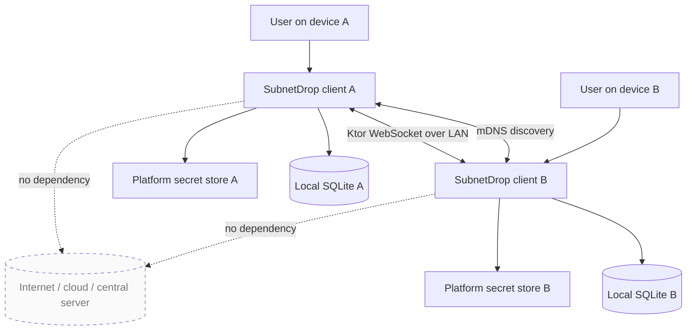
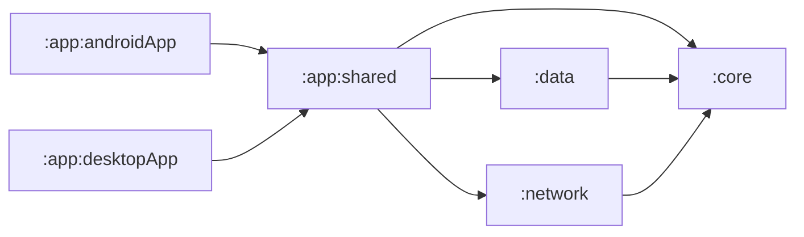
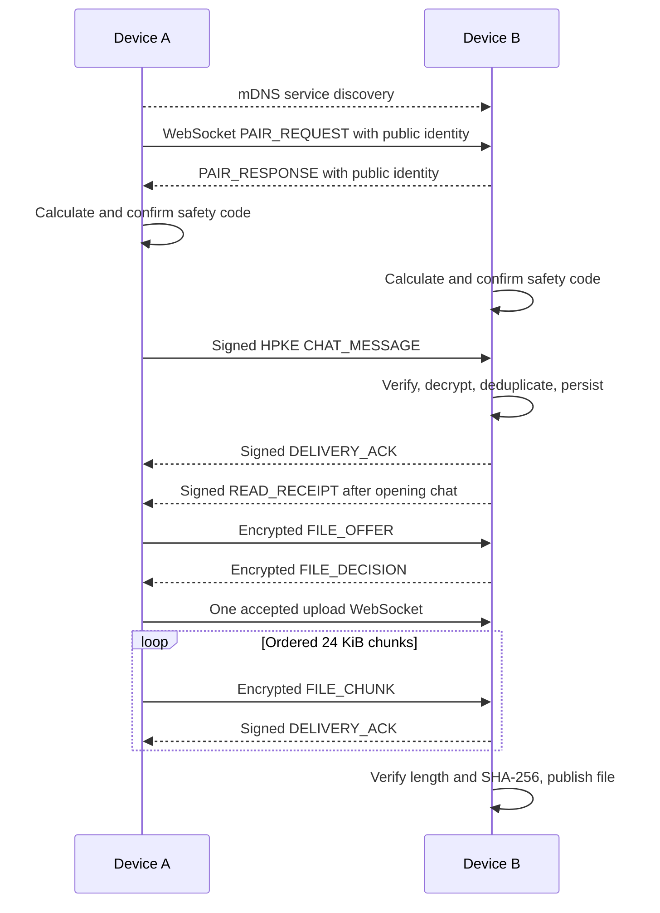

# SubnetDrop 架构与文档入口

本文档是 `docs/` 的唯一入口。README 面向使用者和贡献者概览；这里描述系统边界、模块关系，并把长期原理、
冻结规格和阶段验证分开管理。

## 产品边界

SubnetDrop 是 Android、macOS 和 Windows 之间的无中心局域网传输工具。设备在同一可达网络内自动发现、
显式配对，并直接交换经过认证和加密的一对一消息与文件；身份、信任与聊天历史由各设备独立保存。

不在当前范围内：群聊、互联网中继、NAT 穿透、账号系统、云同步、跨设备历史同步、语音视频通话和推送服务。

## 文档地图

### 技术原理：为什么以及如何工作

- [技术原理目录](technical-principles/README.md)
- [局域网发现](technical-principles/lan-discovery.md)
- [点对点传输](technical-principles/p2p-transport.md)
- [配对与端到端加密](technical-principles/end-to-end-encryption.md)
- [可靠消息与本地存储](technical-principles/reliable-messaging-and-storage.md)
- [加密文件传输](technical-principles/file-transfer.md)
- [KMP 跨平台架构](technical-principles/cross-platform-architecture.md)

### 规格：系统必须满足什么

- [产品与通信协议 v1](spec/subnetdrop-v1.md)
- [加密文件传输 v1](spec/file-transfer-v1.md)

### 执行与验证：当前做到什么程度

- [任务与审查记录](tasks/todo.md)
- [当前平台与桌面验证](tasks/verification/2026-09-04-current-platform-status.md)

## 系统上下文



“P2P”在本项目中的准确含义是：局域网内两端直接建立 TCP/WebSocket 连接，每端同时具备监听和发起连接能力。
它不表示互联网级 DHT、NAT 穿透或中继网络。

## 模块与依赖方向



| 模块 | 职责 | 允许依赖 |
|---|---|---|
| `:core` | 实体、端口、用例和平台无关规则 | Kotlin、Coroutines Flow |
| `:data` | SQLDelight schema 与仓库适配 | `:core`、SQLDelight |
| `:network` | 发现、身份、配对、协议、密码学和传输 | `:core`、Ktor、Tink、平台 API |
| `:app:shared` | Compose UI、ViewModel、导航、文件选择和运行时编排 | `:core`、`:data`、`:network`、Koin |
| `:app:androidApp` | Android 入口、权限与生命周期 | `:app:shared` |
| `:app:desktopApp` | macOS/Windows 入口、窗口与分发 | `:app:shared` |

依赖只能向领域层收敛。Koin 只负责组合对象，不进入领域模型和用例。平台能力通过端口或平台 Koin module 注入，
避免在 common 代码中判断操作系统。

## 核心流程



## 稳定接口

领域层通过这些端口隔离实现细节：

```kotlin
interface PeerDiscovery
interface PairingService
interface ChatTransport
interface FileTransferService
interface SecureMessageCodec
interface ChatRepository
interface PeerRepository
interface TrustedIdentityRepository
```

协议或实现替换应优先保持端口语义稳定。若必须修改数据库字段、帧类型或加密关联数据，先更新 `docs/spec/`，
明确兼容策略与迁移，再修改实现。

## 数据与安全边界

- SQLite 是设备资料、受信身份、会话和消息的本地事实来源。
- HPKE 与 Ed25519 私钥只进入 Android Keystore 包装存储或桌面系统凭据存储。
- mDNS 元数据是公开且不可信的，只用于定位候选设备；不得在发现广播中发布私钥或信任结论。
- 远端地址是临时路由信息，不是身份。信任绑定 `deviceId`、加密公钥和签名公钥。
- 聊天正文目前在 SQLite 中明文保存；传输安全与静态存储安全必须分别描述。
- 文件接收先写临时文件，只有完整性验证成功才能原子发布。

## 平台边界

| 能力 | Android | macOS / Windows Desktop |
|---|---|---|
| 服务发现 | `NsdManager` + Wi-Fi multicast lock | JmDNS |
| 私钥保护 | Android Keystore 包装本地 keyset | java-keyring 对接 Keychain / Credential Manager |
| 数据库驱动 | SQLDelight Android driver | SQLDelight SQLite JDBC driver |
| 文件选择 | FileKit Android provider | FileKit 原生桌面对话框 |
| 接收目录 | 应用专属 external Downloads/SubnetDrop | `~/Downloads/SubnetDrop` |
| UI | Compose Android | Compose Desktop |

平台适配状态和未验证边界以根 [README](../README.md#平台适配状态) 为准，构建命令以
[BUILD_GUILD.md](../BUILD_GUILD.md) 为准。
