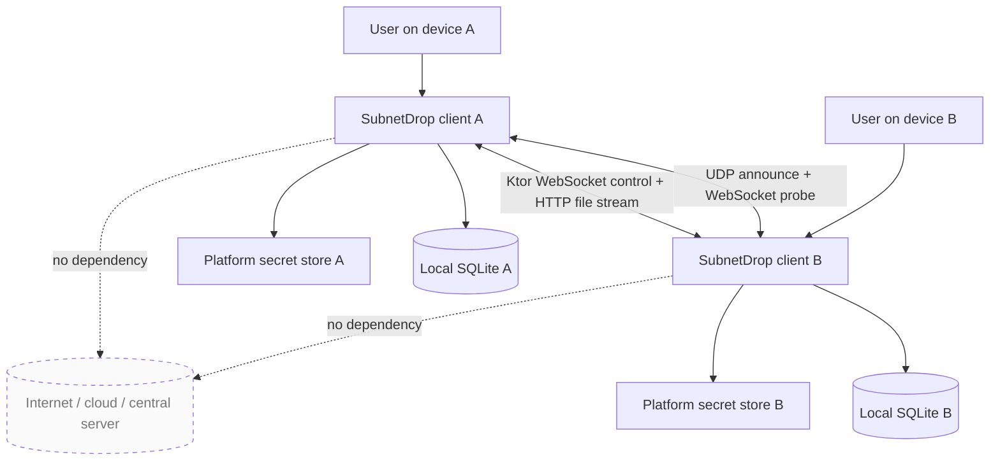
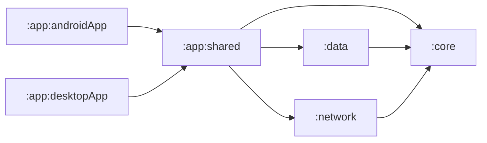
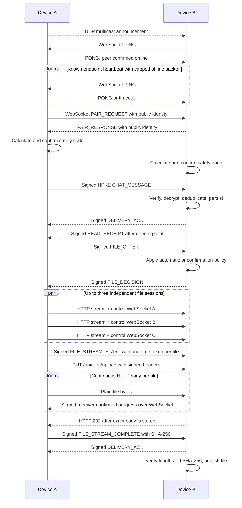

# SubnetDrop 架构与文档入口

本文档是 `docs/` 的唯一入口。README 面向使用者和贡献者概览；这里描述系统边界、模块关系，并把长期原理、
冻结规格和阶段验证分开管理。

## 产品边界

SubnetDrop 是 Android、macOS 和 Windows 之间的无中心局域网传输工具。设备在同一可达网络内自动发现、
显式配对，并直接交换经过认证的加密一对一消息与高速文件；身份、信任与聊天历史由各设备独立保存。

不在当前范围内：群聊、互联网中继、NAT 穿透、账号系统、云同步、跨设备历史同步、语音视频通话和推送服务。

## 文档地图

### 技术原理：为什么以及如何工作

- [技术原理目录](technical-principles/README.md)
- [局域网发现](technical-principles/lan-discovery.md)
- [点对点传输](technical-principles/p2p-transport.md)
- [配对与端到端加密](technical-principles/end-to-end-encryption.md)
- [可靠消息与本地存储](technical-principles/reliable-messaging-and-storage.md)
- [高速文件传输](technical-principles/file-transfer.md)
- [KMP 跨平台架构](technical-principles/cross-platform-architecture.md)

### 规格：系统必须满足什么

- [产品与通信协议 v1](spec/subnetdrop-v1.md)
- [高速文件传输 v1](spec/file-transfer-v1.md)
- [文件消息持久化 v1](spec/persisted-file-messages-v1.md)
- [图片与视频消息预览 v1](spec/media-message-preview-v1.md)
- [文字与文件消息操作 v1](spec/message-actions-v1.md)
- [多文件并行传输 v1](spec/parallel-file-transfer-v1.md)
- [聊天时间线与输入布局 v1](spec/chat-timeline-ui-v1.md)
- [中英日三语与应用内语言切换 v1](spec/localization-v1.md)
- [附近设备删除 v1](spec/peer-deletion-v1.md)

### 设计评估：下一步如何取舍

- [文件传输吞吐升级方案](design-docs/file-transfer-throughput-options.md)

### 执行与验证：当前做到什么程度

- [任务与审查记录](tasks/todo.md)
- [当前平台与桌面验证](tasks/verification/2026-09-04-current-platform-status.md)
- [Android Navigation3 状态刷新验证](tasks/verification/2026-09-05-android-nav-state.md)
- [UDP 设备发现与在线状态验证](tasks/verification/2026-09-05-udp-discovery.md)
- [VPN 与局域网发现共存验证](tasks/verification/2026-09-07-vpn-lan-discovery.md)
- [离线设备自动恢复验证](tasks/verification/2026-09-07-offline-peer-recovery.md)
- [首页手动刷新附近设备验证](tasks/verification/2026-09-07-manual-discovery-refresh.md)
- [桌面聊天页拖放发送文件验证](tasks/verification/2026-09-08-desktop-file-drop.md)
- [中英日三语适配验证](tasks/verification/2026-09-08-localization.md)
- [应用内语言切换验证](tasks/verification/2026-09-08-app-language-setting.md)
- [附近设备删除与历史清理验证](tasks/verification/2026-09-08-peer-deletion.md)
- [文件进度同步与吞吐优化验证](tasks/verification/2026-09-07-file-progress-throughput.md)
- [WebSocket 文件吞吐代码优化验证](tasks/verification/2026-09-08-websocket-transfer-throughput.md)
- [HTTP/1.1 Streaming 文件通道验证](tasks/verification/2026-09-08-http-streaming-file-transfer.md)
- [聊天时间线与 Android IME 验证](tasks/verification/2026-09-05-chat-timeline-ime.md)
- [首页导航与聊天返回验证](tasks/verification/2026-09-05-home-navigation-chat-return.md)
- [文件设置、系统打开与 Android 系统栏验证](tasks/verification/2026-09-05-file-settings-system-bars.md)
- [可配置单文件大小上限验证](tasks/verification/2026-09-07-configurable-file-size-limit.md)
- [跨平台文字消息选择与复制验证](tasks/verification/2026-09-07-message-text-selection.md)
- [暂存区自动提交 Skill 验证](tasks/verification/2026-09-05-staged-auto-commit-skill.md)
- [GitHub Actions 测试安装包验证](tasks/verification/2026-09-04-github-actions-test-packages.md)
- [GitHub Actions 桌面测试包修复](tasks/verification/2026-09-07-github-actions-desktop-packages.md)
- [图片与视频消息预览验证](tasks/verification/2026-09-09-media-message-preview.md)
- [文字与文件消息操作验证](tasks/verification/2026-09-09-message-file-actions.md)

## 系统上下文



“P2P”在本项目中的准确含义是：局域网内两端直接建立 TCP 连接，WebSocket 承载控制，HTTP 承载文件正文；
每端同时具备监听和发起连接能力。它不表示互联网级 DHT、NAT 穿透或中继网络。

## 模块与依赖方向



| 模块 | 职责 | 允许依赖 |
|---|---|---|
| `:core` | 实体、端口、用例和平台无关规则 | Kotlin、Coroutines Flow |
| `:data` | SQLDelight schema 与仓库适配 | `:core`、SQLDelight |
| `:network` | 发现、身份、配对、协议、密码学和传输 | `:core`、Ktor、Tink、平台 API |
| `:app:shared` | Compose UI、ViewModel、导航、文件选择、媒体预览和运行时编排 | `:core`、`:data`、`:network`、Koin、Coil、FileKit |
| `:app:androidApp` | Android 入口、权限与生命周期 | `:app:shared` |
| `:app:desktopApp` | macOS/Windows 入口、窗口与分发 | `:app:shared` |

依赖只能向领域层收敛。Koin 只负责组合对象，不进入领域模型和用例。平台能力通过端口或平台 Koin module 注入，
避免在 common 代码中判断操作系统。

## 核心流程



## 稳定接口

领域层通过这些端口隔离实现细节：

```kotlin
interface PeerDiscovery
interface PairingService
interface ChatTransport
interface FileTransferService
interface FileTransferSettingsRepository
interface SecureMessageCodec
interface ChatRepository
interface PeerRepository
interface TrustedIdentityRepository
```

协议或实现替换应优先保持端口语义稳定。若必须修改数据库字段、帧类型或加密关联数据，先更新 `docs/spec/`，
明确兼容策略与迁移，再修改实现。

聊天文字与文件消息的复制、本地删除、跨设备转发和混合多选状态语义见
[文字与文件消息操作 v1](spec/message-actions-v1.md)。这些瞬时交互状态由共享 Compose UI 持有；文字删除与转发
通过领域用例进入 SQLDelight 和加密发送链路，文件删除同步更新持久化与终态传输状态，文件转发重新进入正式文件
传输服务。Composable 不直接执行数据库或网络 IO。

图片和视频文件消息的分类、4:3 图片缩略图、16:9 视频首帧、完成预览和平台解码边界见
[图片与视频消息预览 v1](spec/media-message-preview-v1.md)。共享图片加载器由 Coil 与 FileKit 组成；Android 视频
首帧使用系统媒体解码能力，桌面首帧由 JVM 平台适配器调用 JCodec，解码失败只影响缩略图，不改变文件终态或打开入口。

## 数据与安全边界

- SQLite 是设备资料、受信身份、会话和消息的本地事实来源。
- HPKE 与 Ed25519 私钥只进入 Android Keystore 包装存储或桌面系统凭据存储。
- UDP 发现元数据是公开且不可信的，只用于定位候选设备；必须经 WebSocket PING 确认可达，且不得在发现广播中
  发布私钥或信任结论。
- 远端地址是临时路由信息，不是身份。信任绑定 `deviceId`、加密公钥和签名公钥。
- 聊天正文目前在 SQLite 中明文保存；传输安全与静态存储安全必须分别描述。
- 文件接收先写临时文件，只有完整性验证成功才能原子发布。

## 平台边界

| 能力 | Android | macOS / Windows Desktop |
|---|---|---|
| 服务发现 | 共享 UDP 组播 + multicast lock；发现会话绑定 IPv4 Wi-Fi，避开 VPN 默认路由 | 共享 UDP 组播；排除 VPN/隧道虚拟网卡 |
| 私钥保护 | Android Keystore 包装本地 keyset | java-keyring 对接 Keychain / Credential Manager |
| 数据库驱动 | SQLDelight Android driver | SQLDelight SQLite JDBC driver |
| 文件选择 | FileKit Android provider | FileKit 原生桌面对话框 |
| 接收目录 | MediaStore 公共 Download/SubnetDrop；可选择 SAF 目录 | 默认 `~/Downloads/SubnetDrop`；可选择本地目录 |
| 文件设置 | Multiplatform Settings + SharedPreferences | Multiplatform Settings + Preferences |
| UI | Compose Android | Compose Desktop |

平台适配状态和未验证边界以根 [README](../README.md#平台适配状态) 为准，构建命令以
[BUILD_GUILD.md](../BUILD_GUILD.md) 为准。
