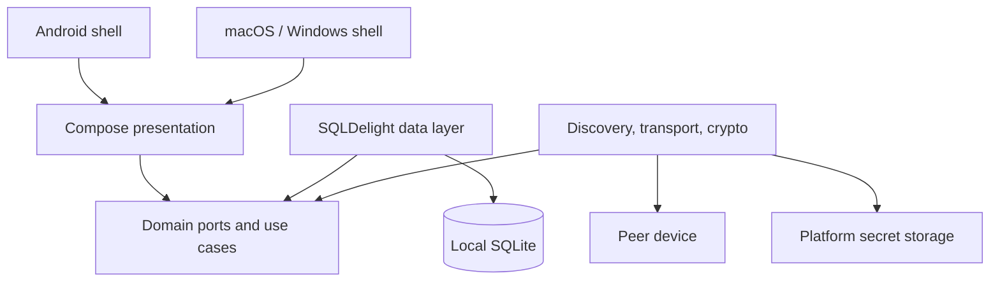
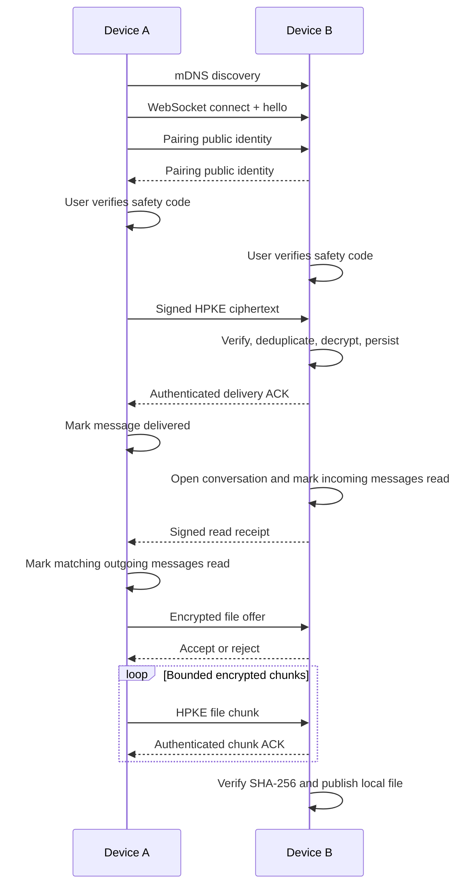

# LAN Chat Architecture

This document is the entry point for the project's technical documentation.

## Product boundary

LAN Chat is a serverless, one-to-one messenger for Android, macOS, and Windows. Devices discover each other on the same local network, pair explicitly, exchange authenticated encrypted messages, and keep their own history locally.

- [Product and protocol specification](spec/lan-chat-v1.md)
- [Encrypted file-transfer specification](spec/file-transfer-v1.md)
- [Active implementation plan](tasks/todo.md)

## System overview

Dependencies point inward. Domain code is pure Kotlin and has no dependency on Compose, Koin, SQLDelight, Ktor, Android APIs, or desktop APIs. Koin is used only at composition roots and presentation boundaries.

## Modules

| Module | Responsibility |
|---|---|
| `:core` | Domain models, ports, and use cases |
| `:data` | SQLDelight schema, local message/history repositories |
| `:network` | mDNS discovery, WebSocket transport, pairing and encryption |
| `:app:shared` | Shared Compose UI and ViewModels |
| `:app:androidApp` | Android entry point, permissions and lifecycle |
| `:app:desktopApp` | macOS/Windows entry point, window and process lifecycle |

The legacy `server` template directory is excluded from Gradle and is not part of the production data path. Clients
never require a central server.

## Main flow

## Platform boundary

Platform-dependent services are expressed as domain ports and supplied by Koin modules:

- Android: `NsdManager`, Wi-Fi multicast handling, Android Keystore, app files and process foreground lifecycle.
- Desktop JVM: JmDNS, OS-specific secure storage, app data directory, firewall-aware listener lifecycle.
