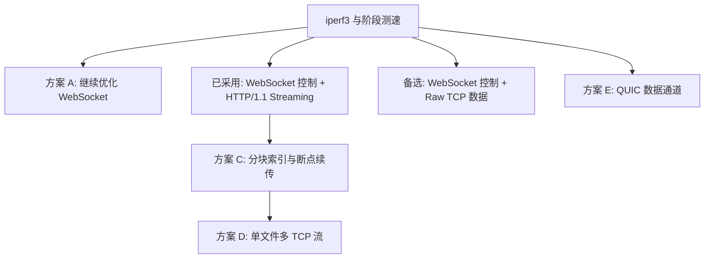
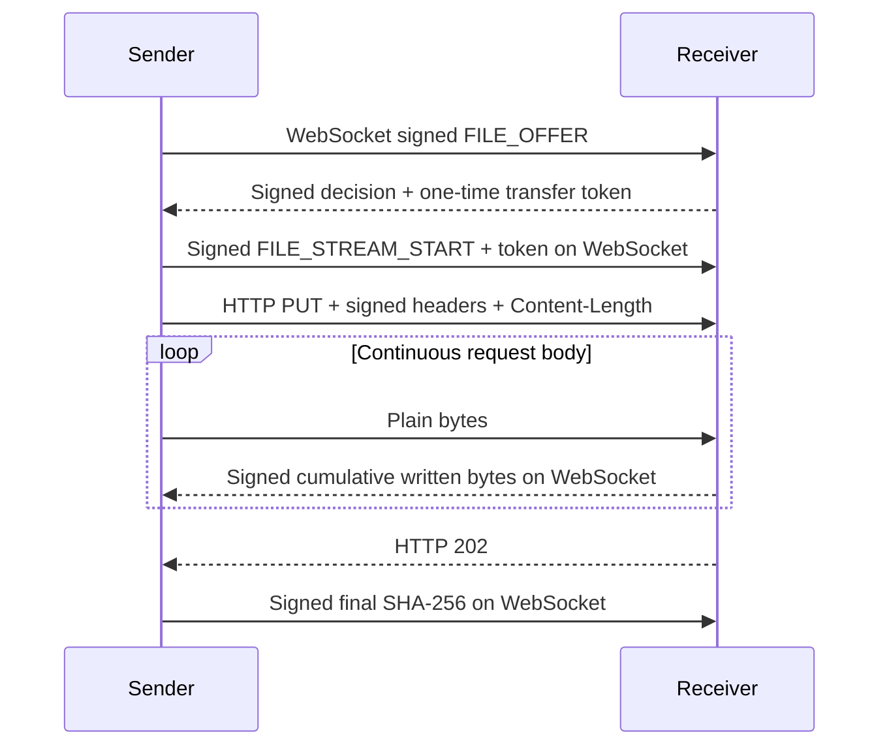

# 文件传输吞吐升级方案

## 决策状态

2026-09-08 已选择并实现“WebSocket 控制 + 独立 HTTP/1.1 Streaming 数据面”。Ktor CIO 在同一监听端口提供
`/chat` WebSocket 和 `/api/files/upload` HTTP PUT；每个文件使用独立连接，进程最多同时上传三个文件。文件
内容不加密，双方流式计算 SHA-256。

迁移前的基线把控制帧与文件正文都放在 WebSocket：按 512 KiB 发送二进制帧，每 4 MiB 停止并等待接收端签名
确认。即使复用数组与 buffered Sink，这种停等和 WebSocket masking/帧解析仍会限制连续吞吐。本次迁移移除了
文件正文的 WebSocket framing，进度改为独立异步事件；512 KiB 仅保留为本地可复用 I/O 缓冲。

在更换协议前必须用同一网络环境的 `iperf3` TCP 吞吐作为上限，并分别记录源文件读取、WebSocket 发送、接收、
SHA-256 和写盘耗时。否则无法区分 2.4 GHz/AP 双跳、VPN 路由、手机闪存和应用代码瓶颈。

## 方案关系

## 方案对比

| 方案 | 预期收益 | 优点 | 缺点与风险 | 建议 |
|---|---|---|---|---|
| A. 深化现有 WebSocket | 低到中 | 改动小；继续复用 Ktor；协议和测试成本最低 | 客户端 masking 与帧复制仍存在；很难达到零拷贝；优化上限有限 | 完成阶段测速后只做有证据的定点优化 |
| B. WebSocket 控制 + HTTP/1.1 Streaming | 中到高 | 复用 Ktor、安全状态机和同一端口；去除正文 masking 与应用层停等；标准流式背压 | 仍有 HTTP 请求解析和框架复制；不是理论最低开销 | 已采用，先完成真实设备基准 |
| R. WebSocket 控制 + Raw TCP 数据 | 中到高，可逼近 TCP 基准 | 数据头最小；桌面可进一步尝试零拷贝 | 要自定义 framing、监听与错误响应；安全和互操作维护面更大 | 仅在 HTTP 明显低于 TCP 基准时重评 |
| C. 固定分块索引 + 断点续传 | 不直接提高峰值，显著降低失败重传成本 | 大文件中断后只补缺块；可做分块校验；为多流奠定基础 | 需要持久化 session、块位图和源文件指纹；临时文件生命周期更复杂 | 在 HTTP Streaming 稳定后实施 |
| D. 单文件 2–4 条 TCP 流 | 特定高带宽/高丢包环境可能提高 | 多拥塞窗口可填满高带宽链路；可并行读取和写入不同 offset | 普通 Wi-Fi 可能更慢；抢占 AP；随机写、内存和调度成本增加；需动态退化为单流 | 基准证明单流受限后再做，默认最多 2 流 |
| E. QUIC/HTTP/3 | 高丢包网络可能更稳定 | 多流无 TCP 队头阻塞；原生流量控制；未来扩展性好 | KMP/JVM/Android 成熟实现和打包成本高；UDP 可能被 VPN、防火墙限制；二进制体积和维护面扩大 | 当前不采用 |

## 已采用的 HTTP/1.1 Streaming 数据面

控制通道继续使用已有 WebSocket 和 Ed25519。接收端只为已接受的 transfer ID 签发短时、单次令牌，并把令牌绑定到
发送方、接收方、文件大小和过期时间；HTTP 请求必须在读取正文前验证 Token、Ed25519 签名、控制连接和
`Content-Length`。数据仍为产品当前定义的明文，最终长度与 SHA-256 校验不变。进度采用累计已写入目标 sink 的
字节数，不把本地 socket buffer 当作已接收。

## 决策建议

1. 先在 2.4 GHz、5 GHz、VPN 开/关四种环境记录 `iperf3` 与 SubnetDrop 吞吐。
2. 对比旧 WebSocket 数据面和新 HTTP 数据面的单流吞吐、CPU、GC、源读取与目标写入耗时。
3. 若 HTTP Streaming 达到 TCP 基准的 80% 以上，优先处理网络和存储环境，不继续自定义传输协议。
4. 稳定后再加入方案 C；断点续传解决可靠性，不与本次数据面迁移混在同一协议版本。
5. 只有 HTTP 单流持续显著低于 TCP 基准，且阶段测速证明瓶颈来自框架层时，才重新评估 Raw TCP。
