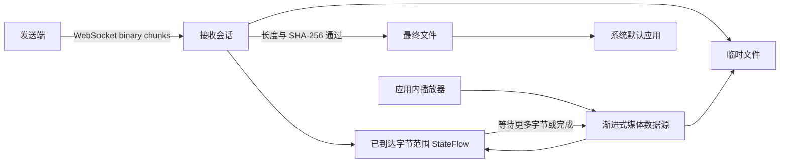

# 渐进式媒体预览方案

## 目标与当前边界

SubnetDrop 的文件通道已经按 512 KiB 分块接收并持续写盘，具备实现渐进式预览的数据基础。但“用系统应用打开
一个仍在增长的文件”没有跨平台可靠性：播放器可能在第一次读到 EOF 后直接停止，可能任意 seek 到尚未到达的
位置，容器元数据也可能位于文件尾部。因此 v1 只在文件完整并通过长度与 SHA-256 校验后开放系统应用打开。

本方案的目标是在不减慢文件通道、不改变文件内容明文策略的前提下，为可渐进解码的图片和音视频提供应用内预览。

## 建议架构

渐进式数据源必须提供以下确定性行为：

- 读取范围完全落在已接收区域时立即返回。
- 读取触及尚未接收区域时挂起，收到新分块后恢复；传输失败或取消时返回显式错误。
- 禁止 seek 到声明总长度之外，对尚未到达的 seek 设置超时和取消语义。
- 播放进度与传输进度分离，文件仍只在最终摘要验证通过后发布。

## 平台播放器

- Android 可接入 [AndroidX Media3 的渐进式媒体源](https://developer.android.com/media/media3/exoplayer/progressive)
  和自定义数据源。
- macOS/Windows 需要选择维护活跃、许可证兼容并能随 Compose Desktop 打包的 KMP 播放器；当前候选是
  [ComposeMediaPlayer](https://github.com/kdroidFilter/ComposeMediaPlayer)，但引入前必须在 Windows 与 macOS
  安装包中验证原生依赖、seek 行为和资源释放。
- 图片可以先实现 JPEG 等可渐进解码格式的节流预览；PNG、HEIF 等格式不能仅凭扩展名假定支持渐进显示。

## 格式限制

- MP4 只有在索引元数据可提前获得时适合渐进播放；文件尾部 `moov` 的普通 MP4 可能必须等待接收完成。
- 音频和视频是否可播由容器、编码器和平台解码器共同决定，MIME 类型只能用于筛选候选，不能作为保证。
- 外部系统应用仍只打开完整文件；边收边播必须走受控的应用内媒体数据源。

## 验收标准

1. 播放器只能读取已接收数据，不会把短暂 EOF 当成传输完成。
2. 传输暂停、失败、取消和摘要失败都会结束播放器并显示准确状态。
3. seek 不会绕过最大文件大小、路径或会话身份校验。
4. Android、macOS、Windows 分别用至少一种音频和一种 fast-start MP4 完成真机/目标系统验证。
5. 不支持渐进播放的格式自动退化为“接收完成后打开”，不展示虚假的可播放状态。
