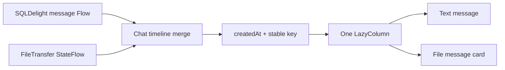

# Chat timeline and input layout v1

## Goal

Present text and file activity as one familiar one-to-one conversation while keeping delivery metadata and the Android
keyboard from changing the message content layout.

## Timeline model

The presentation layer combines persisted `Message` rows and current-session `FileTransfer` state into one ordered
timeline. Each item has a namespaced stable key and a creation timestamp; only messages for the selected conversation and
file transfers for the selected peer are included.

The domain/presentation merge remains chronological. The `LazyColumn` renders that result in reverse order with
`reverseLayout`, placing the newest stable-key item at bottom index 0. This bottom anchor is preserved when the IME reduces
the viewport, so the composer pushes the list upward instead of covering the newest item. Focusing the composer also
scrolls to index 0 first, covering the case where the user was reading older history before opening the keyboard.

File cards align right for outgoing transfers and left for incoming transfers. Name, total size, progress, terminal
state, error and cancellation remain part of that card. V1 still does not persist transfer progress across process
restarts; this UI change does not turn a transfer session into a database row.

## Text delivery state

The text bubble contains only message content. An outgoing message's sending, delivered, unread, read or failed state is
rendered in a separate row immediately below the bubble. A failed state remains clickable for retry.

## Android keyboard behavior

The chat page consumes the IME bottom inset as outer layout padding. The header stays in place, the lazy timeline takes
the remaining height, and the composer sits directly above the keyboard. The Activity uses `adjustResize`; Scaffold
system-bar padding is explicitly consumed before the page applies IME padding so the navigation-bar inset is not counted
twice.

## System chrome and navigation

The transparent Android status bar is backed by white, and the home header uses the same white background. The chat root
always paints an opaque `surfaceContainerLowest` background; its white header and composer use no tonal or shadow
elevation. Compact navigation disables pop and predictive-pop content transforms so returning from chat to home is
immediate instead of looking like the whole page is closing.

The home bottom navigation contains only Nearby and Settings. Opening a trusted nearby device enters its one-to-one chat;
there is no separate conversation-list tab or presentation observer for it.

Clearing the current selection must not emit an empty text-message list while Navigation 3 may still retain the outgoing
entry. The last list remains available until the entry is disposed, and the timeline filters text rows by conversation ID
so a newly selected peer cannot briefly display another conversation.

## Acceptance criteria

1. A single-line text message is vertically centered inside the minimum-height bubble; multiline messages grow while
   keeping the configured vertical padding.
2. File-message cards measure from their icon, text/status content and optional action. They have only a responsive
   maximum width and must not apply a fixed or minimum card width.
3. Sending or receiving a file adds a directional card to the same scrollable list as text messages.
4. Text and file items are ordered by creation time, with stable deterministic ordering for equal timestamps.
5. Read/unread and failure metadata never contributes to the text bubble's measured content.
6. Focusing the Android input keeps the composer at the keyboard top while the message list shrinks.
7. Desktop resizing keeps the single timeline scrollable and does not create a separate fixed-height transfer panel.
8. The Android home status bar and home header render white; the chat header and composer have no elevation shadow.
9. Returning from compact chat to home has no closing/pop animation, file-only transient state, transparency or overlap.
10. Opening or resizing the IME keeps the newest message immediately above the composer without overlap.
11. The home bottom navigation exposes only Nearby and Settings.
