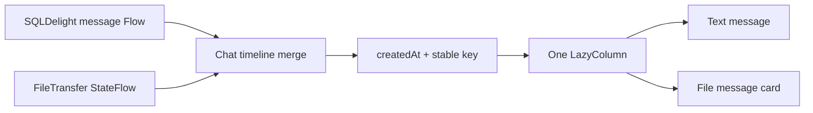

# Chat timeline and input layout v1

## Goal

Present text and file activity as one familiar one-to-one conversation while keeping delivery metadata and the Android
keyboard from changing the message content layout.

## Timeline model

The presentation layer combines persisted `Message` rows and current-session `FileTransfer` state into one ordered
timeline. Each item has a namespaced stable key and a creation timestamp; only file transfers for the selected peer are
included.

File cards align right for outgoing transfers and left for incoming transfers. Name, total size, progress, terminal
state, error and cancellation remain part of that card. V1 still does not persist transfer progress across process
restarts; this UI change does not turn a transfer session into a database row.

## Text delivery state

The text bubble contains only message content. An outgoing message's sending, delivered, unread, read or failed state is
rendered in a separate row immediately below the bubble. A failed state remains clickable for retry.

## Android keyboard behavior

The chat page consumes the IME bottom inset as outer layout padding. The header stays in place, the lazy timeline takes
the remaining height, and the composer sits directly above the keyboard. The Activity uses `adjustResize`; Scaffold
system-bar padding is explicitly consumed before the page applies IME padding so the navigation-bar inset is not counted
twice.

## Acceptance criteria

1. A single-line text message is vertically centered inside the minimum-height bubble; multiline messages grow while
   keeping the configured vertical padding.
2. File-message cards measure from their icon, text/status content and optional action. They have only a responsive
   maximum width and must not apply a fixed or minimum card width.
3. Sending or receiving a file adds a directional card to the same scrollable list as text messages.
4. Text and file items are ordered by creation time, with stable deterministic ordering for equal timestamps.
5. Read/unread and failure metadata never contributes to the text bubble's measured content.
6. Focusing the Android input keeps the composer at the keyboard top while the message list shrinks.
7. Desktop resizing keeps the single timeline scrollable and does not create a separate fixed-height transfer panel.
