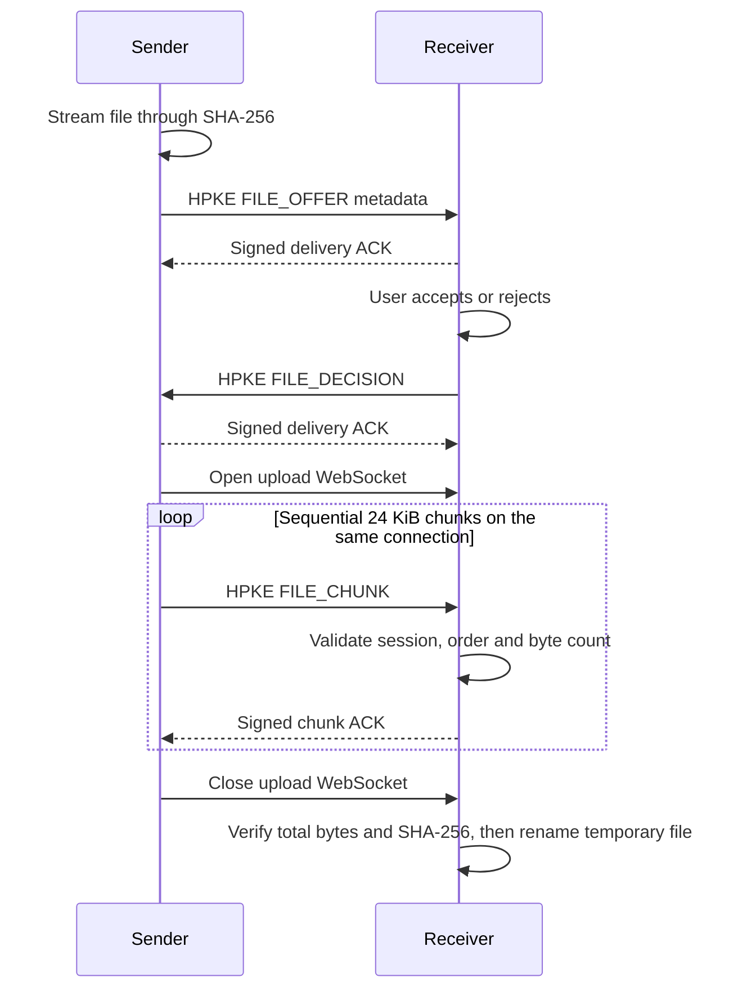

# Encrypted file transfer v1

## Goal

Add one-to-one file transfer between trusted SubnetDrop peers without a central server. The feature is inspired by
[LocalSend's metadata-first upload session](https://github.com/localsend/protocol), while retaining SubnetDrop's existing
device identity and HPKE trust model.

## Product behavior

- A sender selects one local file from an open conversation.
- The receiver sees the file name and size and must explicitly accept or reject the offer.
- Accepted files show live byte progress on both devices.
- Completed incoming files are stored in the platform download directory under a `SubnetDrop` folder.
- Failed, rejected and cancelled transfers remain visible for the current app session with an explicit state.
- File contents are streamed in bounded chunks and are never loaded into memory as one buffer.
- Transfer cards and progress are not persisted across application restarts in v1; successfully received files remain
  on disk.

## Domain API

```kotlin
interface FileTransferService {
    val incomingOffers: StateFlow<List<IncomingFileOffer>>
    val transfers: StateFlow<List<FileTransfer>>

    suspend fun sendFile(peerId: String, file: LocalFile)
    suspend fun acceptOffer(transferId: String)
    suspend fun rejectOffer(transferId: String)
    suspend fun cancelTransfer(transferId: String)
}
```

## Protocol

The protocol uses the existing Ktor WebSocket endpoint and trusted peer identities. Control requests use short-lived
request/response sessions. After acceptance, all chunks for one file reuse a single upload session.



Control payloads and chunks are encrypted and authenticated with HPKE plus Ed25519 using frame metadata as associated
data. The SHA-256 digest protects whole-file integrity and allows validation before the temporary file becomes visible.
The encrypted chunk is currently Base64 encoded inside a JSON text frame. This remains within the 64 KiB frame limit but
adds encoding overhead; a future binary channel must preserve the same authenticated metadata and validation rules.

## Limits and validation

- Trusted peers only.
- One file per transfer session in v1.
- Maximum file size: 10 GiB.
- Chunk plaintext size: 24 KiB.
- Maximum file name length: 255 characters.
- File names are reduced to a leaf name; path separators, blank names and control characters are rejected.
- Chunks must arrive exactly once and in ascending order.
- A transfer must not write more bytes than declared in its offer.
- Rejected, cancelled, timed-out or invalid transfers delete their temporary data.
- Existing destination files are preserved by selecting a collision-free final name.

## Platform behavior

- Android, macOS and Windows use FileKit's Compose Multiplatform launcher and platform-native file dialog.
- Android provider-backed selections are copied through FileKit into app cache before the JVM transport reads them.
- Desktop received files use `~/Downloads/SubnetDrop`; Android uses the app-specific external Downloads directory.

## Acceptance criteria

1. A trusted desktop peer can select and offer a file from a conversation.
2. The receiver must accept before any file bytes are sent.
3. Both sides expose progress and terminal state.
4. A successful receiver file has the exact byte count and SHA-256 digest of the source.
5. Tampered, reordered, oversized and untrusted traffic is rejected without publishing a destination file.
6. JVM unit/integration tests cover accepted multi-chunk transfer, rejection and tamper/order validation.
7. Android, macOS and Windows file selection, destination handling and cross-platform transfer are verified on their
   target systems before release.
