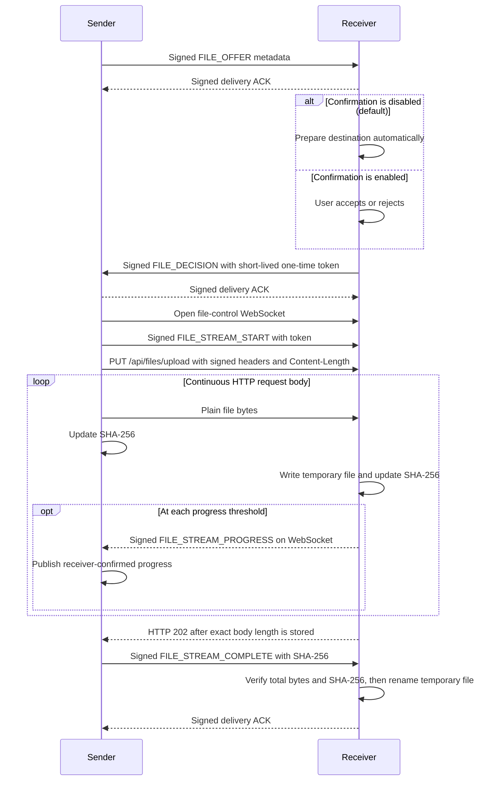

# High-speed file transfer v1

## Goal

Add one-to-one file transfer between trusted SubnetDrop peers without a central server. The feature is inspired by
[LocalSend's metadata-first upload session](https://github.com/localsend/protocol), while retaining SubnetDrop's existing
device identity and trust model.

## Product behavior

- A sender selects up to 50 local files from an open conversation. On desktop, dropping regular files anywhere inside
  the open chat page provides the same input. Pasting an operating-system file list into the focused composer performs
  the same validation but requires explicit confirmation before sending. Every file is an independent transfer and message.
- At most three outgoing transfers run concurrently across all batches; queued items remain visible as `PREPARING`.
- Incoming offers are accepted automatically by default. The receiver can enable per-file confirmation in Settings;
  confirmation mode exposes accept and reject actions before any content bytes are sent.
- Each transfer appears in the conversation timeline as a directional file-message card, interleaved with text by its
  creation time instead of being rendered in a separate transfer panel.
- Accepted files show live byte progress on both devices.
- The receiver can choose a persistent save directory in Settings. The initial value is the platform download directory
  under a `SubnetDrop` folder.
- The per-file size limit is persisted per device. It defaults to 10 GiB and can be configured from 1 to 1024 GiB;
  sender and receiver enforce their own limits independently.
- A completed incoming file, or the sender's existing source file, can be opened with the operating system's default
  application from its file-message card.
- Android stores incoming files in the public `Download/SubnetDrop` MediaStore collection by default. An entry remains
  pending and invisible to other applications until length and SHA-256 validation succeeds; cancellation or failure
  deletes it. A user-selected SAF directory remains supported and takes precedence over the default.
- Completed, failed, rejected and cancelled transfers are persisted as conversation history with an explicit state.
- A completed file message stores its local source/destination path. If that path is missing, the card displays `已失效`
  and does not invoke the operating-system opener.
- File contents are streamed in bounded chunks and are never loaded into memory as one buffer.
- Active progress is process-local. Terminal file-message cards are restored from SQLDelight after restart; successfully
  received files remain on disk independently of their database metadata.

## Domain API

```kotlin
interface FileTransferService {
    val incomingOffers: StateFlow<List<IncomingFileOffer>>
    val transfers: StateFlow<List<FileTransfer>>

    suspend fun sendFile(peerId: String, file: LocalFile)
    suspend fun sendFiles(peerId: String, files: List<LocalFile>)
    suspend fun acceptOffer(transferId: String)
    suspend fun rejectOffer(transferId: String)
    suspend fun cancelTransfer(transferId: String)
}

interface FileTransferSettingsRepository {
    val settings: StateFlow<FileTransferSettings>
    suspend fun updateSaveDirectory(path: String)
    suspend fun updateRequireIncomingConfirmation(required: Boolean)
    suspend fun updateMaxFileSizeBytes(maxFileSizeBytes: Long)
}
```

## Protocol

Protocol version 2 separates the authenticated control plane from the file data plane. Offers, decisions, progress,
cancellation and completion remain signed WebSocket frames. An accepted file is uploaded as one HTTP/1.1 request whose
body is consumed and written continuously; HTTP and WebSocket listen on TCP port `45892` but use separate connections.



The receiver generates a 32-byte URL-safe random token only after accepting an offer. The token expires after five minutes,
can start only one upload, and is repeated in the signed decision, signed stream-start frame and HTTP bearer credential.
The HTTP request also carries an Ed25519 signature over protocol version, sender, receiver, transfer ID, token and declared
`Content-Length`. A copied token alone therefore cannot authorize another identity, transfer or body length.

File bytes are intentionally not encrypted and are not Base64 encoded. Both devices calculate SHA-256 while streaming, and
the signed completion frame binds the sender's final digest to the authenticated transfer. This detects modification but
does not hide the file or HTTP authorization metadata from an observer on the same network.

The sender publishes only receiver-confirmed bytes. The receiver sends signed cumulative progress over the control
WebSocket after each 4 MiB written threshold while the HTTP request continues independently; the sender never stops the
file body to wait for an application-level checkpoint. Ktor channels and a reusable 512 KiB read/write buffer keep memory
bounded, while TCP backpressure naturally slows the source reader when the receiver or network cannot keep up.

## Limits and validation

- Trusted peers only.
- One file per transfer session, up to 50 files per picker batch and three active outgoing sessions per process.
- Configurable per-device file size: 1–1024 GiB, default 10 GiB. The 1024 GiB ceiling is also the protocol hard limit.
- One HTTP/1.1 upload request per file, with a required and exact `Content-Length`.
- Implementation I/O buffer: 512 KiB. It is not an application protocol frame or acknowledgement boundary.
- Asynchronous progress threshold: 4 MiB, plus terminal convergence. It never pauses the HTTP body.
- Upload authorization: 32-byte URL-safe one-time token, five-minute expiry, and Ed25519-signed request metadata.
- Maximum file name length: 255 characters.
- File names are reduced to a leaf name; path separators, blank names and control characters are rejected.
- A transfer must not write more bytes than declared in its offer.
- Rejected, cancelled, timed-out or invalid transfers delete their temporary data.
- Existing destination files are preserved by selecting a collision-free final name.
- Automatic acceptance means a trusted peer can consume receiver bandwidth and disk space. Users who do not want that
  policy must enable per-file confirmation.

## Platform behavior

- Android, macOS and Windows use FileKit's Compose Multiplatform launchers and platform-native file/directory dialogs.
- macOS and Windows additionally accept the operating system's file-list drag payload on an open chat page. Dragged
  files use the same batch-count, metadata and configured size validation as picker selections; directories and other
  payload types are rejected instead of being interpreted as files.
- When the desktop composer has focus, Ctrl/Cmd+V intercepts only an operating-system file-list payload. It reuses the
  picker/drop validation and displays the destination plus selected files for confirmation. Cancelling creates no file
  message, database row or network transfer; ordinary text paste remains native text-field behavior.
- Android provider-backed selections are size-checked before FileKit copies them into app cache for the JVM transport.
- Android retains access to a selected Storage Access Framework directory. Desktop stores the selected path directly.
- Desktop initially uses `~/Downloads/SubnetDrop`. Android uses MediaStore to publish completed files in the public
  `Download/SubnetDrop` collection, so other applications can open them without access to the app-private directory.
- A receiver-side file card is openable only after final length and SHA-256 validation publishes the completed file.
- Files that are still being received cannot be opened from the receiver-side message card.

## Acceptance criteria

1. A trusted desktop peer can select and offer a file from a conversation.
2. With confirmation disabled, a valid offer from a trusted peer is accepted automatically; with confirmation enabled,
   the receiver can reject it without receiving file bytes.
3. Both sides expose progress and terminal state.
4. A successful receiver file has the exact byte count and SHA-256 digest of the source.
5. Tampered, truncated, overlong and untrusted traffic is rejected without publishing a destination file.
6. JVM integration tests cover authenticated streaming, missing authentication, changed source length, rejection,
   receiver-confirmed progress and parallel transfers.
7. Android, macOS and Windows file selection, destination handling and cross-platform transfer are verified on their
   target systems before release.
8. The confirmation preference and save directory survive application restart.
9. Terminal file messages and local paths survive application restart; duplicate live/history IDs render once.
10. Missing completed files display `已失效` and cannot invoke the operating-system opener.
11. A multi-file batch runs up to three independent transfers concurrently; one ordinary failure does not cancel siblings.
12. Sender and receiver expose per-file byte progress and converge to 100% only after final validation and ACK.
13. File-size settings survive restart; the sender blocks files over its local limit and the receiver rejects offers over
    its own limit.
14. Dropping one or more regular files into an open desktop chat displays a drop affordance and sends them through the
    same batch transfer path as picker selections; directories, non-file payloads and oversized batches fail explicitly.
15. Pasting desktop files into the focused composer requires confirmation before invoking the same validated batch
    transfer path, while ordinary text paste remains unchanged.
