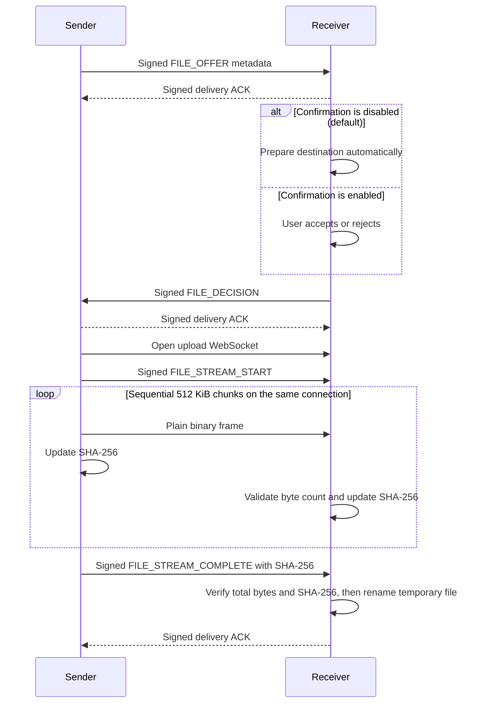

# High-speed file transfer v1

## Goal

Add one-to-one file transfer between trusted SubnetDrop peers without a central server. The feature is inspired by
[LocalSend's metadata-first upload session](https://github.com/localsend/protocol), while retaining SubnetDrop's existing
device identity and trust model.

## Product behavior

- A sender selects one local file from an open conversation.
- Incoming offers are accepted automatically by default. The receiver can enable per-file confirmation in Settings;
  confirmation mode exposes accept and reject actions before any content bytes are sent.
- Each transfer appears in the conversation timeline as a directional file-message card, interleaved with text by its
  creation time instead of being rendered in a separate transfer panel.
- Accepted files show live byte progress on both devices.
- The receiver can choose a persistent save directory in Settings. The initial value is the platform download directory
  under a `SubnetDrop` folder.
- A completed incoming file, or the sender's existing source file, can be opened with the operating system's default
  application from its file-message card.
- Failed, rejected and cancelled transfers remain visible for the current app session with an explicit state.
- File contents are streamed in bounded chunks and are never loaded into memory as one buffer.
- Transfer cards and progress are not persisted across application restarts in v1; successfully received files remain
  on disk.

## Domain API

```kotlin
interface FileTransferService {
    val incomingOffers: StateFlow<List<IncomingFileOffer>>
    val transfers: StateFlow<List<FileTransfer>>

    suspend fun sendFile(peerId: String, file: LocalFile)
    suspend fun acceptOffer(transferId: String)
    suspend fun rejectOffer(transferId: String)
    suspend fun cancelTransfer(transferId: String)
}

interface FileTransferSettingsRepository {
    val settings: StateFlow<FileTransferSettings>
    suspend fun updateSaveDirectory(path: String)
    suspend fun updateRequireIncomingConfirmation(required: Boolean)
}
```

## Protocol

The protocol uses the existing Ktor WebSocket endpoint and trusted peer identities. Control requests use short-lived
request/response sessions. After acceptance, all chunks for one file reuse a single upload session.



File control payloads are authenticated with Ed25519. File bytes are intentionally not encrypted: they are sent as raw
binary WebSocket frames without Base64 conversion or per-chunk acknowledgement. Both devices calculate SHA-256 while
streaming, and the signed completion frame binds the sender's final digest to the authenticated transfer. This detects
modification but does not hide the file from an observer on the same network.

## Limits and validation

- Trusted peers only.
- One file per transfer session in v1.
- Maximum file size: 10 GiB.
- Binary chunk size: 512 KiB.
- Maximum file name length: 255 characters.
- File names are reduced to a leaf name; path separators, blank names and control characters are rejected.
- Chunks must arrive exactly once and in ascending order.
- A transfer must not write more bytes than declared in its offer.
- Rejected, cancelled, timed-out or invalid transfers delete their temporary data.
- Existing destination files are preserved by selecting a collision-free final name.
- Automatic acceptance means a trusted peer can consume receiver bandwidth and disk space. Users who do not want that
  policy must enable per-file confirmation.

## Platform behavior

- Android, macOS and Windows use FileKit's Compose Multiplatform launchers and platform-native file/directory dialogs.
- Android provider-backed selections are copied through FileKit into app cache before the JVM transport reads them.
- Android retains access to a selected Storage Access Framework directory. Desktop stores the selected path directly.
- Desktop initially uses `~/Downloads/SubnetDrop`; Android initially uses the app-specific external Downloads directory.
- A receiver-side file card is openable only after final length and SHA-256 validation publishes the completed file.
- Bytes are streamed to disk while receiving, but v1 does not claim progressive media playback. Opening a growing file
  in an external application cannot guarantee blocking reads, range semantics, codec support, or a playable MP4 index.

## Acceptance criteria

1. A trusted desktop peer can select and offer a file from a conversation.
2. With confirmation disabled, a valid offer from a trusted peer is accepted automatically; with confirmation enabled,
   the receiver can reject it without receiving file bytes.
3. Both sides expose progress and terminal state.
4. A successful receiver file has the exact byte count and SHA-256 digest of the source.
5. Tampered, reordered, oversized and untrusted traffic is rejected without publishing a destination file.
6. JVM unit/integration tests cover accepted multi-chunk transfer, rejection and tamper/order validation.
7. Android, macOS and Windows file selection, destination handling and cross-platform transfer are verified on their
   target systems before release.
8. The confirmation preference and save directory survive application restart.
