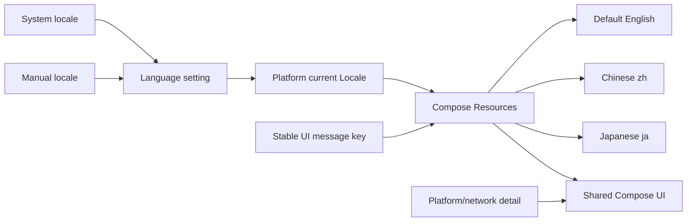

# Localization v1

## Goal

SubnetDrop 的 Android、macOS 和 Windows 用户界面支持英语、简体中文和日语。应用默认跟随操作系统语言，用户也
可以在设置中固定使用简体中文、English 或日本語；选择结果在重启后保留。

## Resource model

所有产品文案使用 Compose Multiplatform Resources。默认 `values` 提供英语，`values-zh` 提供简体中文，
`values-ja` 提供日语；产品名、设备名、文件名、路径、安全码和底层异常详情不翻译。

语言偏好由领域端口暴露只读 `StateFlow`，Multiplatform Settings 适配器负责持久化。共享 Compose 根节点把选择应用
到 Android/JVM 当前 Locale，并以语言为 key 重建 Compose Resources 环境；“跟随系统”恢复进程启动时捕获的系统
Locale。普通页面状态在组合期间解析资源。ViewModel 只保存稳定消息键、格式参数和可选错误详情，不保存某一种语言
的成功/失败文案。文件选择与桌面拖放使用稳定错误类型，再由当前 UI locale 翻译。

## Coverage

- 首页、附近设备、设置、运行状态和信任状态。
- 聊天标题、空状态、发送/已读状态、文件传输状态与拖放提示。
- 配对确认和文件接收弹窗。
- Snackbar 成功/失败通知、文件选择与目录选择错误。
- 图标按钮和可操作控件的无障碍描述。

README 和技术文档本身不要求提供三份翻译；它们只记录产品支持的语言和实现边界。

## Error boundary

可预测的产品错误必须翻译。来自 Ktor、FileKit、操作系统、密钥存储或文件系统的具体错误详情保留原文，以当前语言
的操作失败前缀包装，避免翻译丢失诊断信息。聊天正文、远端设备名和远端文件名始终按原内容展示。

## Acceptance criteria

1. 默认选择“跟随系统”；系统语言为英语、简体中文或日语时使用对应资源，其他语言回退到英语。
2. 用户可在设置页切换“跟随系统 / 简体中文 / English / 日本語”，无需重启即可更新当前界面。
3. 手动选择写入本地设置，应用重启后恢复；未知或损坏的存储值安全回退为“跟随系统”。
4. 正常使用路径中不再以 Kotlin 字面量维护某一种语言的用户可见文案。
5. 动态数量、范围、设备名、文件名和错误详情使用占位符格式化，不通过字符串拼接固定语序。
6. ViewModel 的延迟通知在展示时按当前语言解析，不把已经翻译的固定文案写入状态。
7. 文件选择和桌面拖放的已知校验错误支持三语；未知平台详情允许保留原文。
8. Android 和桌面编译通过，JVM 测试验证设置持久化、三套资源键完整且代表性文案可读取。
