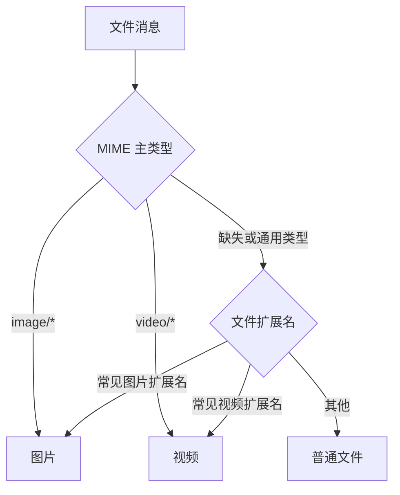

# 图片与视频消息预览 v1

## 目标

聊天时间线继续把所有传输项视为文件消息，但根据可信 MIME 类型和文件扩展名把视觉形态分成普通文件、图片和视频。
图片使用不带左右气泡尖角的 4:3 圆角缩略图卡片，视频使用同样造型的 16:9 首帧卡片；完成且本地文件仍存在时
显示预览，点击后仍由操作系统默认应用打开，不在应用内增加播放器或图片查看器。

## 分类规则

- MIME 类型优先；`application/octet-stream`、空值和不合法值才回退到不区分大小写的扩展名。
- 图片扩展名覆盖 JPEG、PNG、GIF、WebP、BMP、HEIF/HEIC、AVIF 和 SVG。
- 视频扩展名覆盖 MP4、MOV、M4V、MKV、WebM、AVI、WMV、FLV、MPEG/MPG、3GP、TS、M2TS、OGV 和 AV1。
- 分类只影响展示，不改变传输协议、明文文件数据面、持久化字段或外部打开行为。

## 状态与交互

| 文件状态 | 图片/视频卡片 | 点击 |
|---|---|---|
| 准备、等待接受、传输中 | 图片 4:3、视频 16:9 类型占位，包含文件名、字节进度、进度条和取消按钮 | 不打开 |
| 完成且本地文件存在 | 图片内容或视频首帧；视频叠加播放标识；底部显示文件名和大小 | 系统默认应用 |
| 完成但文件不存在 | 保持对应媒体比例的已失效占位 | 不打开 |
| 拒绝、取消、失败 | 保持对应媒体比例的终态占位与错误信息 | 不打开 |

发送方源文件虽然在传输前已经存在，也必须等传输完成后才进入预览态，避免视觉上把尚未送达误解为成功。预览加载、
缩略图解码和文件存在性检查都在后台调度器执行，Composable 不直接执行阻塞文件 IO。

## 平台实现与边界

- 图片：Compose Multiplatform 使用 Coil 3，通过 FileKit Coil 集成读取桌面路径和 Android `content://` URI；预览请求
  明确限制为 720×540，解码和缓存的是缩略图结果，系统打开入口仍使用原始文件。
- Android 视频：使用 Coil Video 解码第一帧，支持系统媒体解码器能够读取的格式。
- macOS/Windows 视频：使用纯 JVM JCodec 读取常见 H.264/MP4/QuickTime 首帧。JCodec 无法覆盖 HEVC、AV1 等所有
  系统可播放编码；解码失败时显示视频占位，但文件仍可交给系统应用打开。
- GIF 等动态图按图片处理，只显示由 Coil 解码得到的静态/默认画面，本规格不引入应用内播放。

## 验收标准

1. 图片保持 4:3、视频保持 16:9 圆角矩形，所有状态均不显示左右气泡尖角；窗口缩放不拉伸内容，预览使用裁剪填充。
2. 完成图片显示本地内容；完成视频显示首帧或明确的视频占位，且点击均走现有系统打开入口。
3. 传输中能同时辨认媒体类型、文件名、累计字节、总大小、进度和取消入口。
4. 普通文件卡片、文件传输协议、数据库 schema 和消息排序不发生行为变化。
5. Android `content://` 与桌面文件路径均不会在主线程读取。
