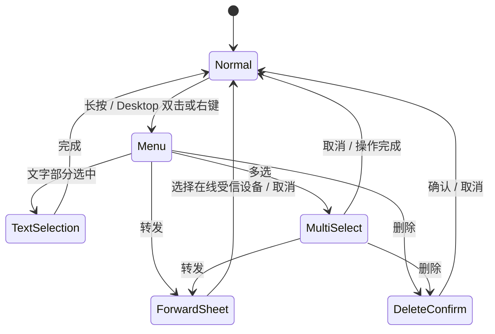

# 文字与文件消息操作 v1

## 范围

本规格作用于聊天时间线中的文字和文件消息。文件的“删除”只删除消息记录和当前进程中的终态展示，不删除磁盘
实体；文件“转发”创建全新的文件传输，不能复用原 transfer ID 或伪装为已经完成。

## 交互

- Android/桌面长按、桌面双击或右键消息项打开紧凑操作菜单。单击文字不执行动作；单击已完成且存在的文件继续
  使用系统默认应用打开。
- 操作菜单必须以实际可见的文字气泡或文件/媒体卡片为锚点，不能以占满聊天时间线的整行容器为锚点；发送消息
  跟随右侧卡片，接收消息跟随左侧卡片，并继续由弹层在窗口边缘自动避让。
- 文字复制将完整正文写入系统剪贴板。文件复制只在本地文件仍存在时启用：桌面写入操作系统原生文件列表载荷，
  Android 对 `content://` 写入 URI，普通路径则复制路径文本。
- 文件菜单提供复制文件、转发、删除和多选；“部分选中”只对文字正文有意义，不显示在文件菜单中。
- 部分选中关闭操作菜单并进入当前文字气泡的原生文字选择状态；用户可拖动范围并使用系统复制菜单。
- 单条转发从底部打开当前在线且已建立信任的设备列表。设备项复用首页附近设备的头像、在线状态、名称和信任
  状态布局；点击设备后立即发送并关闭选择器。
- 删除只删除本机数据库消息记录，不发送撤回帧，也不改变对方设备上的消息或磁盘实体文件。
- 多选以触发菜单的消息作为首个选中项。顶部显示已选择数量，文字与终态文件消息左侧均显示选择圆点，底部提供
  转发和删除。
- 多条文字按原始时间顺序转发，每条生成新的 ID、时间戳和端到端加密消息，不复制原送达/已读状态。
- 文件转发只允许状态为完成、本地路径仍存在的消息。Android `content://` 在发送前复制到应用发送缓存，桌面普通
  路径直接复用；每个文件创建新的 offer、进度和持久化记录。
- 活动文件传输可以打开菜单；本地源文件存在时允许复制文件，但不能转发、删除或进入多选，取消仍使用文件卡片
  既有按钮。

## 状态流



## 领域与数据语义

```kotlin
interface ChatRepository {
    suspend fun deleteMessages(conversationId: String, messageIds: List<String>)
    suspend fun deleteFileMessages(conversationId: String, transferIds: List<String>)
}

interface FileTransferService {
    suspend fun dismissTerminalTransfers(transferIds: List<String>)
}
```

- 两类删除接口都必须同时用会话 ID 和消息 ID 限定范围，空列表直接返回。文件删除提交数据库后再移除内存中的
  对应终态 transfer，活动 transfer 不允许通过该入口移除。
- 转发目标由当前 `Peer` 流筛选 `ONLINE + TRUSTED` 得到；离线或密钥变化的设备不能进入目标列表。
- 任一转发失败时保留已经创建的新文字或文件消息及其真实失败状态，并向 UI 显示失败提示，不能回滚或伪装成功。

## 验收标准

1. Android/桌面长按、桌面双击和右键打开同一组操作，不影响单击文件打开和文字部分选中模式下的桌面拖选。
2. 单条和多条复制、删除、转发均只作用于预期文字/文件消息；数据库 Flow 和实时 transfer 状态不会让已删项重现。
3. 多选模式下输入栏不可见，文字与终态文件可混合选择；取消后恢复正常聊天。
4. 转发目标从底部出现，设备列表为空时展示明确空状态，设备项视觉与首页附近设备一致。
5. Android 接收文件可以经缓存重新发送；转发源失效时显式报错，不生成伪成功消息。
6. 中、英、日三套资源键完整，JVM/桌面测试和 Android shared 编译通过。
7. 发送方和接收方的操作菜单都贴近对应消息卡片，不能跳到聊天区域另一侧或页面中部。
8. 桌面文件复制能被 Finder、Explorer 等程序识别为文件，而不是文件名字符串；Android 使用 URI 或路径降级。
