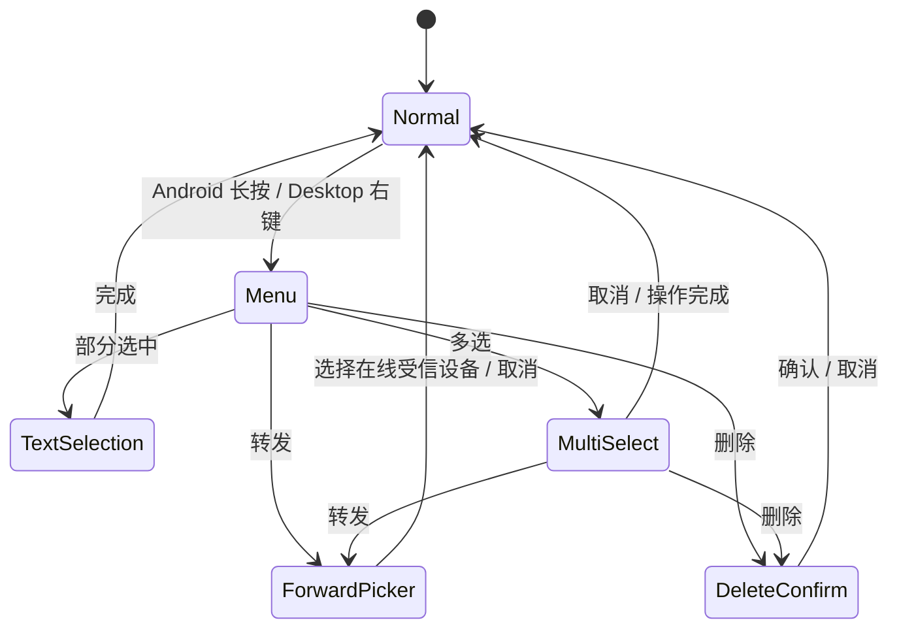

# 文字消息操作 v1

## 范围

本规格只作用于聊天时间线中的文字消息。文件卡片继续使用打开、取消和传输状态交互；文件转发与文件记录删除
需要单独定义本地 URI、实体文件和传输任务的生命周期，不能复用文字消息语义。

## 交互

- Android 长按文字气泡、桌面端右键文字气泡，打开包含复制、转发、部分选中、删除和多选的紧凑菜单。
- 复制将完整正文写入系统剪贴板。
- 部分选中关闭操作菜单并进入当前气泡的原生文字选择状态；用户可拖动选择范围并使用系统复制菜单，点击顶部
  “完成”退出。
- 单条转发打开当前在线且已建立信任的设备列表。点击设备后立即发送，并关闭选择器。
- 删除只删除本机数据库记录，不发送撤回帧，也不改变对方设备上的消息。
- 多选以触发菜单的消息作为首个选中项。顶部显示已选择数量，文字消息左侧显示选择圆点，底部提供转发和删除。
- 多条消息按原始时间顺序转发，每条生成新的 ID、时间戳和端到端加密消息，不复制原送达/已读状态。
- 文件消息不显示选择圆点，不计入多选数量。

## 状态流



## 领域与数据语义

```kotlin
interface ChatRepository {
    suspend fun deleteMessages(conversationId: String, messageIds: List<String>)
}
```

- 删除接口必须同时用会话 ID 和消息 ID 限定范围，空列表直接返回。
- 转发目标由当前 `Peer` 流筛选 `ONLINE + TRUSTED` 得到；离线或密钥变化的设备不能进入目标列表。
- 任意一条转发失败时保留已经创建的新消息及其真实失败状态，并向 UI 显示失败提示，不能回滚或伪装成功。

## 验收标准

1. Android 长按与桌面右键打开同一组操作，不影响普通滚动和部分选中模式下的桌面左键拖选。
2. 单条和多条复制、删除、转发均只作用于预期消息；数据库 Flow 自动刷新时间线。
3. 多选模式下输入栏不可见，文件卡片不能被选中，取消后恢复正常聊天。
4. 在线设备为空时转发选择器展示明确空状态。
5. 中、英、日三套资源键完整，JVM/桌面测试和 Android shared 编译通过。
