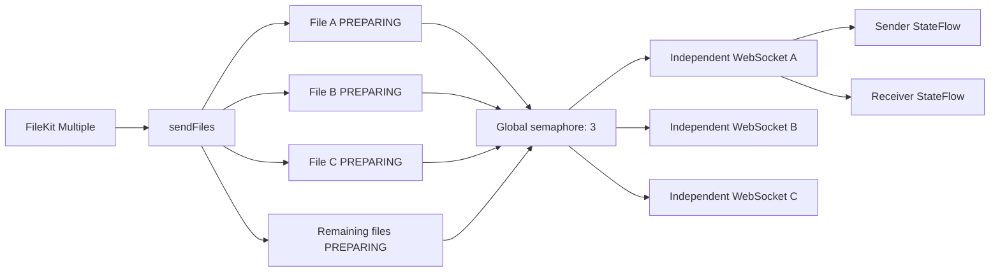

# Parallel file transfer v1

## Goal

Allow one file-picker action to enqueue multiple files, transfer a bounded number concurrently, and display independent
live progress for every file on both peers. This increment keeps the existing authenticated WebSocket data channel;
resumable HTTP sessions are a separate protocol revision because they require persistent partial-session state.

## Product contract

- FileKit multiple selection accepts at most 50 files in one action.
- Every selected file receives its own transfer ID, directional chat item and terminal database record.
- All valid files enter `PREPARING` before waiting for a network slot, so queued files are visible immediately.
- At most three outgoing files are active per process. The limit is shared by all batches and conversations.
- Failure, rejection or cancellation of one file does not cancel siblings in the same batch.
- The batch completes after every child transfer reaches a terminal result. Partial failure is reported explicitly.

## Domain API

```kotlin
interface FileTransferService {
    val transfers: StateFlow<List<FileTransfer>>
    suspend fun sendFile(peerId: String, file: LocalFile)
    suspend fun sendFiles(peerId: String, files: List<LocalFile>)
}
```

`sendFile` remains available for tests and single-file callers. `sendFiles` validates the batch once, launches supervised
children and delegates every item to the same single-file protocol path.

## Concurrency and progress



Each upload uses a 4 MiB progress window. The sender inserts a signed checkpoint after the preceding ordered binary frames;
the receiver responds with its actual written byte count only when it matches that checkpoint. Both cards publish the
receiver-confirmed value, so local WebSocket queueing cannot make the sender run ahead. This is one acknowledgement per
eight 512 KiB chunks rather than a per-chunk round trip. File-frame queues are bounded and every incoming session owns its
I/O lock, so three transfers retain TCP backpressure without serializing their disk writes behind one global mutex.

## Failure semantics

- Coroutine cancellation still cancels the whole caller and marks active child transfers cancelled.
- Ordinary failure is contained to that file. Other children retain their network slots and continue.
- After all children finish, `sendFiles` throws one batch error containing total and failed counts if any ordinary child
  failed. Individual file cards retain the detailed error.
- Rejecting one confirmation-mode offer is a normal terminal result and does not abort the batch.

## Acceptance criteria

1. Selecting multiple files creates one chat timeline item per file.
2. Three confirmation-mode offers can be outstanding together, proving child transfers run concurrently.
3. Accepting all offers transfers exact bytes and persists completed records on both peers.
4. A failed child does not cancel successful siblings, and the batch reports partial failure.
5. Both peers expose receiver-confirmed per-file `transferredBytes`; the sender never advances beyond the receiver and both
   reach terminal 100% through the existing `StateFlow`.
