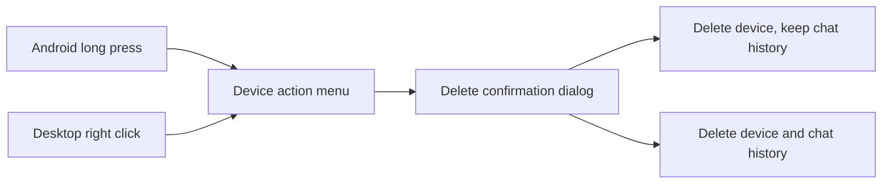

# Nearby peer deletion v1

## Goal

用户可以从附近设备列表忘记不再需要的设备。Android 使用长按打开操作菜单，macOS 和 Windows 使用鼠标右键；
普通点击仍保持打开聊天或发起配对的现有行为。

## Interaction

操作菜单只提供“删除设备”。选择后必须再展示确认 Dialog；Dialog 默认不勾选“同时删除聊天记录”，避免误删历史。
取消 Dialog 不产生任何持久化变化。

## Data semantics

删除设备始终执行以下操作：

1. 取消与目标设备相关的活跃文件传输。
2. 从发现层的在线/离线跟踪集合移除目标设备。
3. 删除已验证公钥，将设备从附近列表隐藏，并将其信任状态重置为未配对。

未勾选历史时保留 conversation、文字消息和文件消息。设备后续再次通过 UDP 公告被发现时，以未配对状态重新出现；
重新核对安全码建立信任后，可以继续查看保留的历史。

勾选历史时，在同一数据库事务中额外删除目标设备的 conversation、文字消息和文件消息，再删除 peer 记录。已经保存
到公共下载目录或用户自定义目录的实体文件不属于聊天数据库，不随历史记录删除。

## State and failure behavior

- SQLDelight 查询失效应通过现有 Flow/StateFlow 自动刷新设备列表与当前聊天状态。
- 当前正在查看被删除设备时，删除成功后关闭该聊天选择。
- 数据库删除失败不得报告成功；删除前已经结束的配对候选或传输状态保持清理结果，并显示本地化错误。
- 活跃设备可能在后续公告中重新出现，这是“附近设备”列表的正常语义；重新出现时不能保留旧信任。

## Acceptance criteria

1. Android 长按与桌面右键不会触发普通点击，同时能打开包含删除操作的菜单。
2. 删除操作必须经过确认，历史记录复选框默认关闭。
3. 不删除历史时设备从列表消失、信任被清除，历史仍存在。
4. 删除历史时文本、文件消息和 conversation 都被删除，但实体文件保留。
5. 删除结果由数据库 Flow 自动反映到 UI，三种语言的菜单、Dialog 和通知文案完整。
