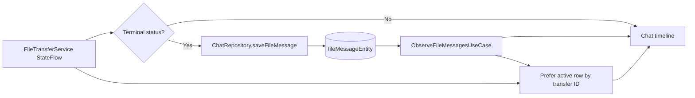

# Persisted file messages v1

## Goal

Make terminal file transfers part of the local conversation history so they remain visible after an application restart.
Store the local source or received-file path and derive whether that path is still usable when rendering the file item.

## Domain and repository contract

`FileTransfer` carries the stable `conversationId` in addition to its transfer ID and peer ID. `ChatRepository` owns both
text and terminal file history:

```kotlin
interface ChatRepository {
    fun observeMessages(conversationId: String): Flow<List<Message>>
    fun observeFileMessages(conversationId: String): Flow<List<FileTransfer>>
    suspend fun saveMessage(message: Message)
    suspend fun saveFileMessage(transfer: FileTransfer)
}
```

Active progress remains in `FileTransferService.transfers`. A transfer is written to SQLDelight only when it reaches
`COMPLETED`, `REJECTED`, `CANCELLED`, or `FAILED`. Rewriting the same transfer ID updates its terminal snapshot
idempotently.

## Storage schema and migration

`fileMessageEntity` stores the transfer ID, conversation/peer identity, display metadata, direction, terminal status,
local path and error. The row references the existing conversation and peer rows; saving a file message creates or
updates its conversation record in the same transaction.

Schema version 2 is reached from version 1 through `1.sqm`. Android uses SQLDelight's schema-aware Android driver.
Desktop must also construct `JdbcSqliteDriver` with `ChatDatabase.Schema` so existing databases execute migrations instead
of only opening the previous schema.



## Timeline and local availability

The presentation layer observes persisted file messages for the selected conversation and merges them with live
transfers for the selected peer. A live transfer replaces a persisted row with the same ID, preventing duplicate Compose
keys while retaining progress updates. After restart, the database row supplies the same directional file card.

For a completed file, availability is derived from `localPath` with FileKit when the card is composed and checked again
when it is clicked. A missing path renders `已失效 · <size>` and disables the operating-system open action. This derived
state is not written back to SQLite because a removable or temporarily unavailable path can become accessible again.
Rejected, cancelled and failed rows retain their own terminal labels instead of being relabeled as expired.

## Acceptance criteria

1. Completed outgoing and incoming files reappear in the correct conversation after process restart.
2. The stored row includes the final sender source path or validated receiver destination path.
3. Rejected, cancelled and failed terminal transfers are persisted with their terminal status and optional error.
4. Live and persisted records with the same transfer ID render exactly one timeline item, preferring live progress.
5. A completed file whose path no longer exists displays `已失效` and cannot invoke the system opener.
6. A version-1 Android or desktop database migrates to version 2 without losing peers, trust, text messages or read state.
7. Persistence and migration have JVM tests; shared timeline merging and file availability have deterministic tests.
