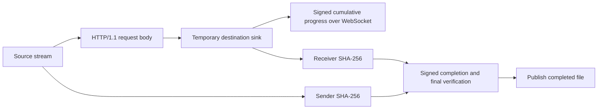

# HTTP/1.1 Streaming 文件通道验证

## 范围

本轮将文件正文从 WebSocket Binary Frame 迁移到独立 HTTP/1.1 PUT 流。WebSocket 继续负责签名提议、决策、
开始、异步接收进度、取消和最终摘要。协议帧主版本由 1 提升到 2，不保留旧文件通道兼容路径。



## 自动验证结果

### 文件传输集成测试

`SubnetDropTransportTest` 共 12 项，全部通过，覆盖：

- 缺少上传认证头的 HTTP 请求被拒绝且不创建传输；
- 默认自动接受后通过 HTTP 流传输并校验完整内容；
- 源文件在 offer 后发生长度变化时双方进入失败，接收端不发布文件；
- 显式接受、拒绝、不超前的接收端确认进度与终态收敛；
- 三文件并行、普通子任务失败隔离、双方独立大小上限；
- 原有配对、加密聊天、去重和轻量可达性探测保持通过。

测试报告：`network/build/test-results/jvmTest/TEST-ink.x2.subnetdrop.network.transport.SubnetDropTransportTest.xml`
记录为 `tests="12" skipped="0" failures="0" errors="0"`。

### 完整回归

执行：

```shell
./gradlew :core:jvmTest :data:jvmTest :network:jvmTest :app:shared:jvmTest \
  :app:desktopApp:compileKotlin :app:shared:compileAndroidMain \
  --no-configuration-cache --stacktrace
```

结果：`BUILD SUCCESSFUL in 5s`，52 个可执行任务中 13 个执行、39 个为最新状态。网络 JVM 测试、桌面编译和
Android shared 编译均成功。

静态检查：`git diff --check` 通过；本轮修改的 Kotlin 文件不存在超过 120 字符的行。

## 未验证边界

- 未安装 Android 应用，也未做 Android 与桌面真机互传；实际 Wi-Fi 吞吐、手机存储写入速度和系统网络策略仍需
  在真实设备上测量。
- 未在 Windows 主机运行；Windows 防火墙与安装包互操作仍以目标系统验证为准。
- 本轮不包含断点续传、HTTP Range、单文件多连接或 TLS；传输中断后仍需重新发送整个文件。
