# SubnetDrop 技术原理

本目录解释 SubnetDrop 长期有效的技术原理：系统为什么这样设计、数据怎样流动、边界在哪里，以及实现必须保持的
不变量。具体字段和验收条件以 `docs/spec/` 为准；某次开发任务和测试结果以 `docs/tasks/` 为准。

## 阅读顺序

| 文档 | 回答的问题 |
|---|---|
| [局域网发现](lan-discovery.md) | 没有服务器时，设备怎样在同一网络内找到彼此？ |
| [点对点传输](p2p-transport.md) | 两台设备怎样建立直接连接，帧怎样交换？ |
| [配对与端到端加密](end-to-end-encryption.md) | 怎样确认对端身份、加密内容并阻止篡改？ |
| [可靠消息与本地存储](reliable-messaging-and-storage.md) | 消息怎样去重、重试、标记已读并在重启后恢复？ |
| [加密文件传输](file-transfer.md) | 为什么先确认再发送，怎样分块、校验和安全落盘？ |
| [KMP 跨平台架构](cross-platform-architecture.md) | 哪些代码共享，哪些能力必须由 Android 或桌面实现？ |

## 一条数据路径

```mermaid
flowchart LR
    Discovery[mDNS discovery] --> Route[Ephemeral host and port]
    Route --> Pairing[Public-key pairing]
    Pairing --> Trust[User-confirmed trusted identity]
    Trust --> Encrypt[HPKE encryption and Ed25519 signature]
    Encrypt --> Transport[Ktor WebSocket]
    Transport --> Verify[Verify, decrypt and deduplicate]
    Verify --> Store[Local SQLite or verified file]
    Store --> UI[Compose UI state]
```

## 文档约束

- 原理文档不记录一次性迁移步骤或某次构建日志。
- 规格文档定义可测试的协议、限制和验收条件，不承担执行计划职责。
- `docs/tasks/todo.md` 只跟踪当前工作；验证证据放在 `docs/tasks/verification/`。
- 修改帧格式、加密关联数据、数据库 schema 或平台边界时，必须同时更新对应原理与规格。

返回 [架构与文档入口](../ARCHITECTURE.md)。
