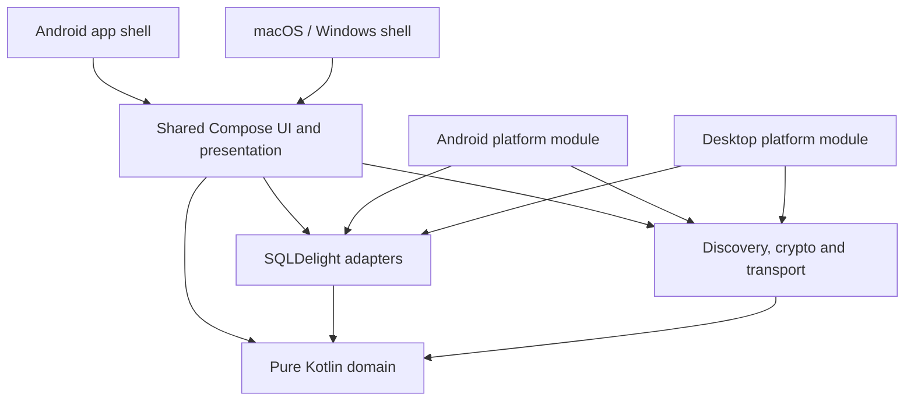
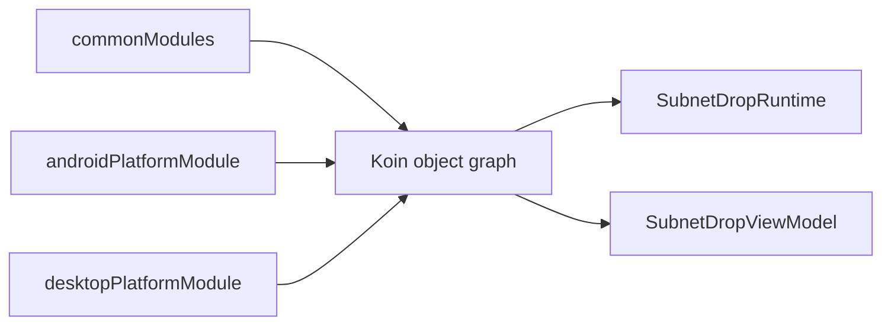

# KMP 跨平台架构原理

当前产品目标只有 Android、macOS 和 Windows。macOS/Windows 共享 Compose Desktop JVM 实现；Android 使用
Kotlin Multiplatform Android target。仓库不把存在历史 iOS/Web 目录等同于已支持平台，Gradle 当前只纳入
Android、JVM 与两个应用入口。

## 共享层次

| Source set / module | 共享内容 |
|---|---|
| `commonMain` | 领域模型、端口、用例、SQLDelight 仓库、协议模型、Compose UI、ViewModel |
| `jvmAndAndroidMain` | Ktor CIO 传输和 Google Tink JVM/Android 密码实现 |
| `jvmAndAndroidMain` | UDP 组播、Ktor CIO 传输和 Google Tink JVM/Android 密码实现 |
| `androidMain` | Wi-Fi multicast lock、Keystore、Android SQLDelight driver、Android Koin module |
| `jvmMain` | java-keyring、SQLite JDBC、桌面 Koin module |
| `androidApp` | `Application`、Activity、权限与生命周期 |
| `desktopApp` | Compose window、进程启动和 DMG/MSI/DEB 分发 |

## Koin 组合根

Koin 在每个进程只启动一次：Android 位于 `Application.onCreate()`，桌面在创建 Compose window 之前。公共
module 定义用例、ViewModel 与运行时编排；平台 module 提供数据库 driver、发现、安全存储、下载目录和传输
实现。

领域代码使用普通构造函数注入，不调用 service locator，也不导入 Koin。

## UI 适配

- Compose Multiplatform 与 Material 3 共享颜色、排版、列表、消息气泡、文件卡片和对话框。
- 紧凑宽度使用 Navigation 3 页面栈，底部只保留“附近设备 / 设置”；聊天由附近设备项直接进入。
- 桌面宽度使用主从双栏；左右列表分别滚动，窗口高度缩小时内容不被固定区域截断。
- 桌面最小窗口为 `480 x 420`，默认 `1180 x 760`。
- FileKit 从 common Compose UI 发起文件与目录选择、执行跨平台文件 I/O 和系统默认应用打开，避免维护
  Android Activity Result 与 AWT 两套业务接口。
- Multiplatform Settings 以同一个领域仓库暴露持久化文件设置，Android 使用 SharedPreferences，桌面使用
  Preferences。

## 平台能力表

| 能力 | common 契约 | Android | macOS / Windows |
|---|---|---|---|
| 发现 | `PeerDiscovery` | 共享 UDP 组播 + multicast lock | 共享 UDP 组播 |
| 数据库 | repository ports | Android driver | SQLite JDBC |
| 私钥 | `SecureKeyValueStore` | Android Keystore | java-keyring |
| 文件选择、目录与打开 | FileKit common API | Android provider / SAF | FileKit native dialog / OS opener |
| 文件设置 | `FileTransferSettingsRepository` | SharedPreferences | Preferences |
| 文件目录 | `FileStorage` | app-specific external directory | user Downloads/SubnetDrop |
| 生命周期 | `SubnetDropRuntime` | ProcessLifecycleOwner | Compose application/window |

## 架构约束

- 不在 common 代码中使用 `System.getProperty("os.name")` 选择业务行为；平台差异由 source set 和 Koin module
  解决。
- 新依赖应优先选择稳定、活跃、真正支持 KMP/Compose 的生态库；密码学、导航、数据库和文件选择不重复造轮子。
- 平台声明必须基于目标系统上的构建与运行证据。macOS 构建通过不能推导 Windows MSI 已可发布。
- Android 与桌面共享协议测试；平台 API 另加 host/device 验证。
- 桌面原生分发只能在对应目标系统生成，签名、系统凭据和防火墙行为必须在真实发布包中验证。
