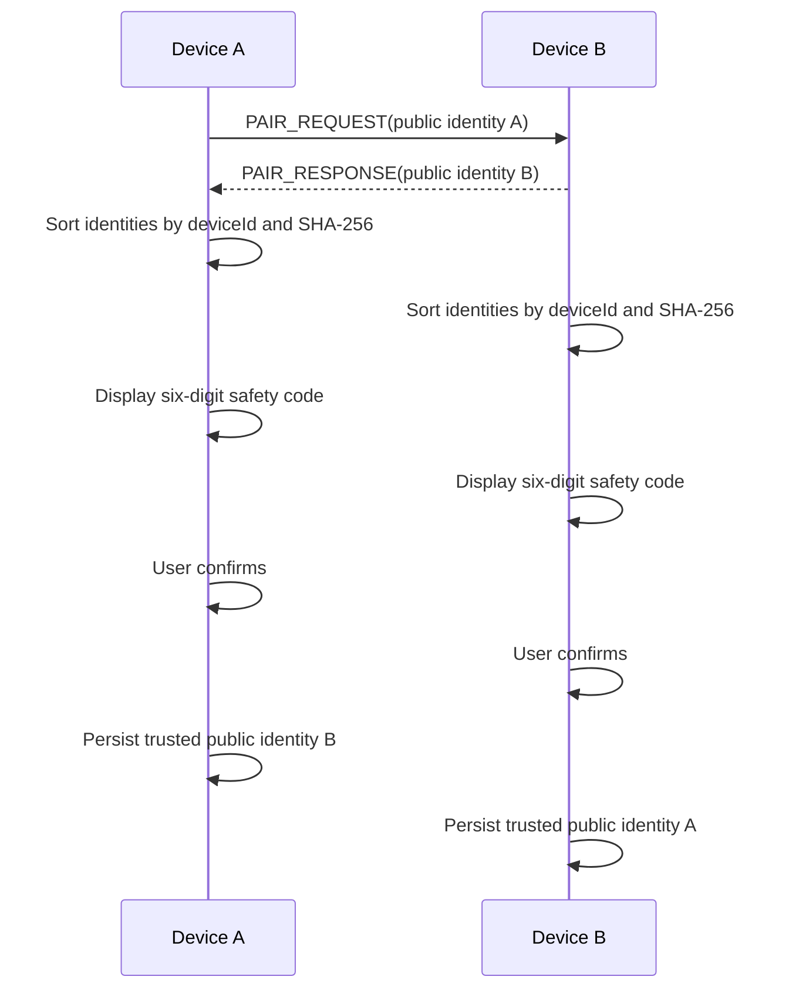
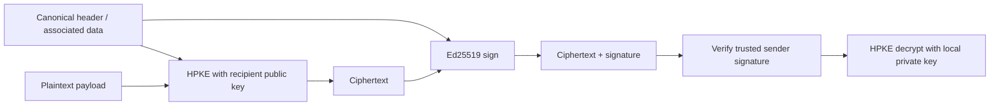

# 配对与端到端加密原理

SubnetDrop 把“发现设备”和“信任设备”严格分开。UDP 公告提供的名称、ID 和地址均可伪造；只有用户核对安全码并
确认后，远端公钥才写入受信身份仓库。

## 设备身份

首次启动只创建随机稳定的 `deviceId` 和本地显示名称，先让 UI 与发现服务就绪。首次配对或加密聊天时再按需生成：

- HPKE X25519 私钥与公钥，用于加密；
- Ed25519 私钥与公钥，用于签名；

私钥 keyset 不写入 SQLite。Android 使用 Android Keystore 中的 AES-256-GCM key 包装本地 keyset；桌面使用
java-keyring 接入 macOS Keychain 或 Windows Credential Manager。数据库只保存设备资料和已确认的远端公钥。

## 配对与安全码

安全码从双方 `deviceId`、HPKE 公钥和 Ed25519 公钥的规范顺序摘要中派生，因此两端应显示相同结果。六位码是
人工核对手段，不是独立的高强度认证凭据；用户不核对就确认时，中间人风险仍然存在。

已信任 `deviceId` 后若发现公钥变化，状态进入 `KEY_CHANGED` 并阻断消息/文件，不能静默覆盖旧信任。

## 内容加密与身份认证

Google Tink 配置：

| 目的 | 算法 |
|---|---|
| 密钥封装 | DHKEM X25519 + HKDF-SHA256 |
| 密钥派生 | HKDF-SHA256 |
| 内容加密 | AES-256-GCM |
| 身份签名 | Ed25519 |

HPKE 解决“只有接收方能解密”，Ed25519 解决“确实由受信发送方产生且未被篡改”。规范头部或 associated data
绑定协议版本、消息/传输 ID、发送者、接收者、时间或分块序号，防止把合法密文挪到另一个上下文重放。

## 各类数据的保护范围

| 数据 | 机密性 | 完整性 / 身份认证 |
|---|---|---|
| 配对公钥与显示名称 | 明文公开 | 安全码人工绑定 |
| 聊天正文 | HPKE | Ed25519 |
| 文件 offer、decision、start、complete、cancel 控制帧 | 不加密 | Ed25519 |
| 文件二进制内容 | 不加密 | 签名完成帧中的 SHA-256 |
| Delivery ACK | 不加密 | Ed25519 |
| Read receipt 的消息 ID | 不加密 | Ed25519 |
| 外层 sender/recipient/type 与流量大小 | 不隐藏 | 按帧类型校验 |

因此“端到端加密”在当前产品中准确指聊天正文。文件传输保留受信设备认证和完整性校验，但不提供机密性。

## 威胁边界与限制

- 可抵御未持有接收方私钥的同网窃听者读取聊天正文，但不阻止其读取文件内容。
- 可拒绝被篡改的密文、签名、发送者、接收者和关联上下文。
- 不能替代用户认真核对安全码。
- 当前静态 HPKE 身份方案不声明前向保密；长期私钥泄露可能影响历史捕获密文的安全性。
- 已解密消息目前以明文写入本机 SQLite，设备解锁后的本地攻击不在传输加密保护范围内。
- 正式桌面发行需要签名/公证并验证应用身份与系统凭据项的隔离关系。

若未来采用 Noise 或 Double Ratchet，应新增协议版本、密钥迁移和互操作规格，不得用同一版本静默改变密码学语义。
