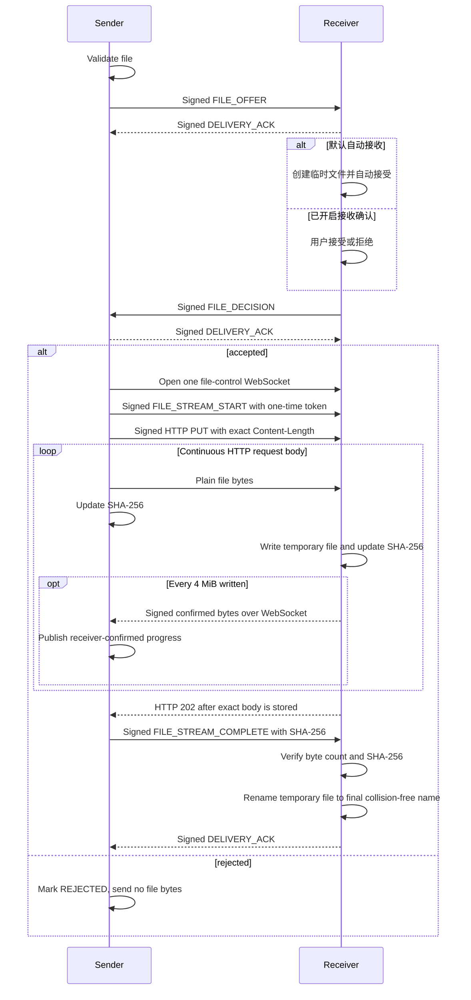
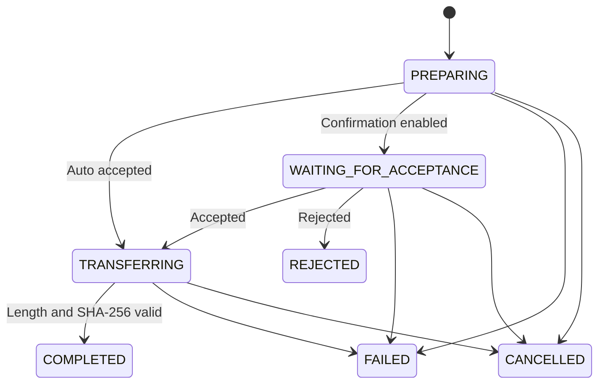

# 高速文件传输原理

文件传输采用“元数据优先、按接收策略决策、再传内容”的会话模型。该思路参考 LocalSend，但 SubnetDrop 使用自身
的设备身份、Ed25519 认证模型和帧协议，不与 LocalSend 客户端互操作。

一次选择可以包含最多 50 个文件，每个文件仍建立独立会话、拥有独立传输 ID 和消息卡片。发送端使用进程级公平
Semaphore 将活动上传限制为 3 个；其余文件保持 `PREPARING`。批量任务使用 supervisor 隔离普通失败，单个文件
失败不会取消其他文件。

## 为什么先发送 offer

SubnetDrop 先发送经过签名的名称、大小和 MIME 类型，再由接收端的持久化设置决定下一步。默认策略是自动接受：
收到可信设备的合法 offer 后立即创建临时文件并返回接受决策。用户可在设置中开启“接收文件前确认”，此时只有
明确接受后才创建写入会话，拒绝不会传输文件字节。offer 最长等待 5 分钟，超时按失败处理。

## 传输流程



## 领域接口与状态

```kotlin
interface FileTransferService {
    val incomingOffers: StateFlow<List<IncomingFileOffer>>
    val transfers: StateFlow<List<FileTransfer>>
    suspend fun sendFile(peerId: String, file: LocalFile)
    suspend fun acceptOffer(transferId: String)
    suspend fun rejectOffer(transferId: String)
    suspend fun cancelTransfer(transferId: String)
}

interface FileTransferSettingsRepository {
    val settings: StateFlow<FileTransferSettings>
    suspend fun updateSaveDirectory(path: String)
    suspend fun updateRequireIncomingConfirmation(required: Boolean)
    suspend fun updateMaxFileSizeBytes(maxFileSizeBytes: Long)
}
```



## 限制与验证

| 项目 | 当前规则 |
|---|---|
| 信任 | 只允许 `TRUSTED` peer |
| 单次会话 | 1 个文件 |
| 最大文件 | 每台设备独立配置 1–1024 GiB，默认 10 GiB |
| 数据通道 | 每文件一个带准确 `Content-Length` 的 HTTP/1.1 PUT 请求 |
| 上传认证 | 五分钟有效、仅使用一次的 32 字节随机 Token + Ed25519 请求签名 |
| I/O 缓冲 | 每条发送和接收流复用 512 KiB 数组，不是协议分块 |
| 进度上报 | 接收端每累计写入 4 MiB 异步签名上报，不阻塞 HTTP 正文 |
| 内存背压 | 由 Ktor ByteChannel 与 TCP 背压限制，不允许整文件排入内存 |
| 文件名 | 最长 255 字符，只允许 leaf name，拒绝路径分隔符、控制字符和空名 |
| 顺序 | 依赖单一 HTTP 请求体的有序字节流，不允许超出声明总量 |
| 总量 | 不得超过 offer 声明字节数 |
| 完成条件 | 实际字节数与 SHA-256 都匹配 |
| 冲突 | 保留已有文件，生成不冲突的最终名称 |

发送侧使用 Ktor `WriteChannelContent` 边读边写 HTTP 正文并同步更新摘要，不在发送前预扫描文件。接收侧通过
`receiveChannel()` 持续消费正文，一个文件只创建一个 buffered Sink、一个摘要器和一个 512 KiB 可复用数组。
当手机写盘变慢时，背压会沿接收 ByteChannel、TCP 和发送 ByteChannel 传回源文件读取，不会把大文件提前堆入
内存。写盘与摘要计算在 IO dispatcher 上按文件独立串行执行，不持有全局传输锁，三路并行不会因其中一路写盘
而全部串行。拒绝、取消、超时、越界或摘要不匹配都必须删除临时数据。

## 平台文件边界

- Android 和桌面统一使用 FileKit 的 Compose Multiplatform launcher。
- macOS/Windows 聊天页还使用 Compose Desktop 系统拖放目标接收文件列表；拖入文件与 FileKit 选择结果汇入同一个
  元数据、批次数量和大小预检函数，再进入现有 `sendFiles`，不会形成另一套传输实现。目录和非文件载荷会被拒绝。
- Android provider 返回的内容先按当前上限检查元数据，再通过 FileKit 复制到应用 cache，避免超限文件在拒绝前占用
  本机空间，最后交给 JVM 共享传输实现读取。
- 保存目录与单文件大小上限通过 Multiplatform Settings 持久化；Android 自定义目录使用 SAF 并保留 URI 权限，
  桌面保存路径字符串。
- Android 默认通过 MediaStore 写入系统公共 `Download/SubnetDrop`：接收期间设置 `IS_PENDING`，长度与
  SHA-256 校验成功后才发布，失败或取消时删除条目。
- MediaStore pending 条目的 `OpenableColumns.SIZE` 可能尚未刷新，因此 Android 的落盘长度从
  `ParcelFileDescriptor.statSize` 获取。提供方无法报告长度时，以协议累计字节数、写入流关闭结果和 SHA-256 为准。
- 桌面默认目录是 `~/Downloads/SubnetDrop`；各平台都不会覆盖同名目标。
- 接收完成并通过长度与 SHA-256 校验后，文件消息可调用系统默认应用打开；发送侧打开原始源文件。图片和视频消息
  在完成且本地文件存在时切换为 4:3 预览卡，图片由 Coil 读取，视频展示平台生成的首帧；打开行为仍走系统应用。
- 完成、拒绝、取消和失败的文件消息持久化到 SQLDelight；完成项保存本地路径，重启后仍会出现在聊天时间线。
- 文件卡片组合时和打开前都会重新检查本地路径；文件被删除或移动后显示“已失效”，且不会调用系统打开器。
- 发送端不把“已写入本机 HTTP 通道”误报为传输进度。接收端每实际写入 4 MiB 后通过控制 WebSocket 异步发送
  签名累计值，双方消息卡片以这个值为准；HTTP 正文无需等待进度回应，完成校验后双方才收敛到 100%。

## 安全与性能取舍

文件内容不做 HPKE 加密，不进行 Base64/JSON 转换，也不等待应用层分块 ACK。HTTP/1.1 只承担连续字节流和标准
背压；WebSocket 只承担签名控制事件和异步进度。接收决策签发的一次性 Token 有五分钟有效期，HTTP 请求签名把
协议版本、双方身份、传输 ID、Token 与长度绑定，Token 被使用一次后立即失效。最终摘要能发现内容被篡改，但
局域网观察者仍可能读取文件原文和 HTTP 元数据，这是为吞吐明确接受的产品取舍。

默认自动接收还意味着可信对端可以主动占用接收方带宽和磁盘。对这一策略不满意的用户应开启逐文件确认；无论
采用哪种策略，文件大小上限、文件名校验、顺序校验和最终摘要校验都保持不变。

可测试的协议要求见 [文件传输 v1 规格](../spec/file-transfer-v1.md)。
