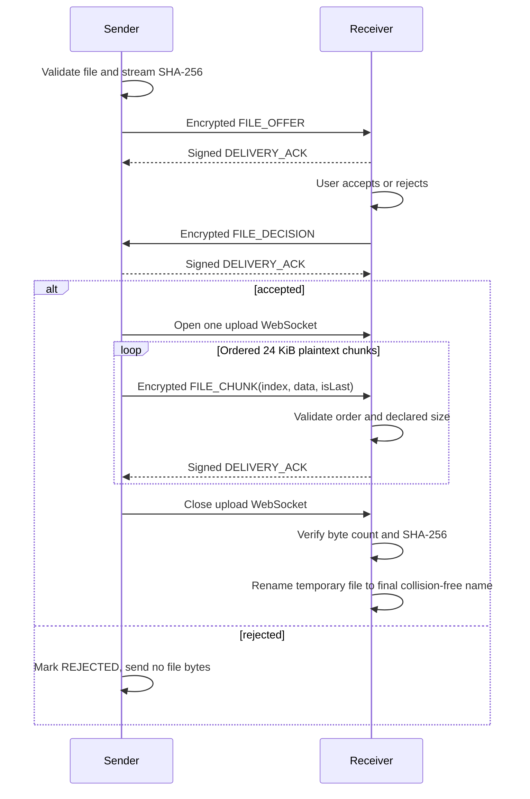
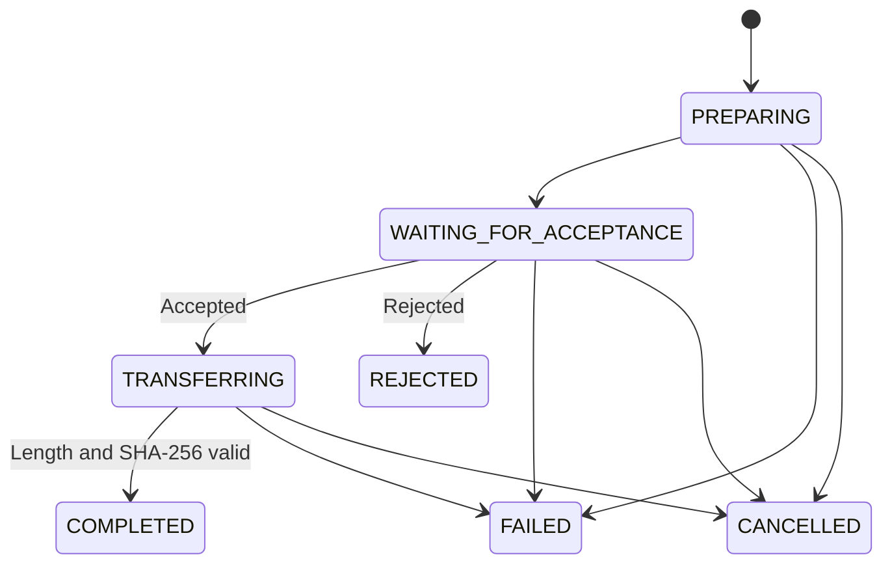

# 加密文件传输原理

文件传输采用“元数据优先、接收方确认、再传内容”的会话模型。该思路参考 LocalSend，但 SubnetDrop 使用自身
的设备身份、HPKE/Ed25519 安全模型和帧协议，不与 LocalSend 客户端互操作。

## 为什么先发送 offer

直接推送文件会让接收端在未同意时消耗带宽和磁盘。SubnetDrop 先加密发送名称、大小、MIME 类型与 SHA-256，
接收方明确接受后才创建临时文件和上传会话。offer 最长等待 5 分钟，超时是失败而不是默认接受。

## 传输流程



## 领域接口与状态

```kotlin
interface FileTransferService {
    val incomingOffers: StateFlow<List<IncomingFileOffer>>
    val transfers: StateFlow<List<FileTransfer>>
    suspend fun sendFile(peerId: String, file: LocalFile)
    suspend fun acceptOffer(transferId: String)
    suspend fun rejectOffer(transferId: String)
    suspend fun cancelTransfer(transferId: String)
}
```



## 限制与验证

| 项目 | 当前规则 |
|---|---|
| 信任 | 只允许 `TRUSTED` peer |
| 单次会话 | 1 个文件 |
| 最大文件 | 10 GiB |
| 明文分块 | 24 KiB |
| 文件名 | 最长 255 字符，只允许 leaf name，拒绝路径分隔符、控制字符和空名 |
| 顺序 | index 必须从 0 严格递增，不允许重排或重复 |
| 总量 | 不得超过 offer 声明字节数 |
| 完成条件 | 实际字节数与 SHA-256 都匹配 |
| 冲突 | 保留已有文件，生成不冲突的最终名称 |

发送侧流式计算哈希并逐块读取，不把整个文件放进内存。接收侧只写临时文件；拒绝、取消、超时、越界、乱序、
解密失败或摘要不匹配都必须删除临时数据。

## 平台文件边界

- Android 和桌面统一使用 FileKit 的 Compose Multiplatform launcher。
- Android provider 返回的内容通过 FileKit 复制到应用 cache，再交给 JVM 共享传输实现读取。
- Android 保存到应用专属 external Downloads/SubnetDrop；桌面保存到 `~/Downloads/SubnetDrop`。
- 桌面同名目标不会被覆盖。

## 当前性能取舍

每个分块先 HPKE 加密，再作为 Base64 字符串进入 JSON 帧。这样能复用严格的文本协议、64 KiB 帧限制和现有
测试，但 Base64 约增加三分之一体积，并产生额外编码与分配成本。后续二进制数据通道应继续保持分块边界、
associated data、顺序 ACK、最大文件限制和最终摘要校验。

可测试的协议要求见 [文件传输 v1 规格](../spec/file-transfer-v1.md)。
