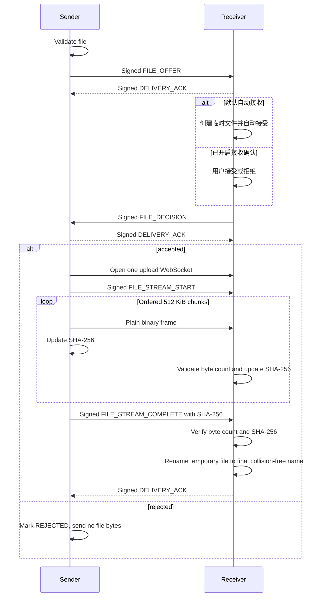
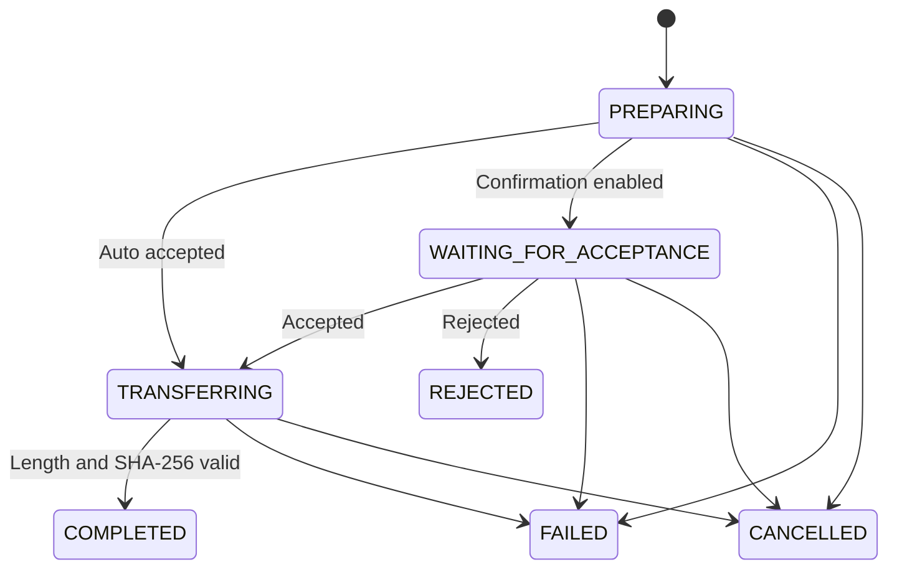

# 高速文件传输原理

文件传输采用“元数据优先、按接收策略决策、再传内容”的会话模型。该思路参考 LocalSend，但 SubnetDrop 使用自身
的设备身份、Ed25519 认证模型和帧协议，不与 LocalSend 客户端互操作。

## 为什么先发送 offer

SubnetDrop 先发送经过签名的名称、大小和 MIME 类型，再由接收端的持久化设置决定下一步。默认策略是自动接受：
收到可信设备的合法 offer 后立即创建临时文件并返回接受决策。用户可在设置中开启“接收文件前确认”，此时只有
明确接受后才创建写入会话，拒绝不会传输文件字节。offer 最长等待 5 分钟，超时按失败处理。

## 传输流程



## 领域接口与状态

```kotlin
interface FileTransferService {
    val incomingOffers: StateFlow<List<IncomingFileOffer>>
    val transfers: StateFlow<List<FileTransfer>>
    suspend fun sendFile(peerId: String, file: LocalFile)
    suspend fun acceptOffer(transferId: String)
    suspend fun rejectOffer(transferId: String)
    suspend fun cancelTransfer(transferId: String)
}

interface FileTransferSettingsRepository {
    val settings: StateFlow<FileTransferSettings>
    suspend fun updateSaveDirectory(path: String)
    suspend fun updateRequireIncomingConfirmation(required: Boolean)
}
```



## 限制与验证

| 项目 | 当前规则 |
|---|---|
| 信任 | 只允许 `TRUSTED` peer |
| 单次会话 | 1 个文件 |
| 最大文件 | 10 GiB |
| 明文分块 | 512 KiB 原始二进制帧 |
| 文件名 | 最长 255 字符，只允许 leaf name，拒绝路径分隔符、控制字符和空名 |
| 顺序 | 依赖单一 WebSocket 的有序传输，不允许超出声明总量 |
| 总量 | 不得超过 offer 声明字节数 |
| 完成条件 | 实际字节数与 SHA-256 都匹配 |
| 冲突 | 保留已有文件，生成不冲突的最终名称 |

发送侧边读边发并流式计算哈希，不在发送前预扫描文件，也不把整个文件放进内存。接收侧同步计算
摘要并只写临时文件；拒绝、取消、超时、越界或摘要不匹配都必须删除临时数据。

## 平台文件边界

- Android 和桌面统一使用 FileKit 的 Compose Multiplatform launcher。
- Android provider 返回的内容通过 FileKit 复制到应用 cache，再交给 JVM 共享传输实现读取。
- 保存目录通过 Multiplatform Settings 持久化；Android 使用 SAF 目录并保留 URI 权限，桌面保存路径字符串。
- Android 默认目录是应用专属 external Downloads/SubnetDrop，桌面默认目录是 `~/Downloads/SubnetDrop`。
- 桌面同名目标不会被覆盖。
- 接收完成并通过长度与 SHA-256 校验后，文件消息可调用系统默认应用打开；发送侧打开原始源文件。

## 安全与性能取舍

文件内容不做 HPKE 加密，不进行 Base64/JSON 转换，也不为每个分块等待网络 ACK。文件会话的提议、决策、
开始和完成帧使用 Ed25519 认证，最终摘要能发现内容被篡改，但局域网观察者仍可能读取文件原文。这是为
最大化吞吐而明确接受的产品取舍。

默认自动接收还意味着可信对端可以主动占用接收方带宽和磁盘。对这一策略不满意的用户应开启逐文件确认；无论
采用哪种策略，文件大小上限、文件名校验、顺序校验和最终摘要校验都保持不变。

## 渐进式媒体边界

当前接收端边收边写磁盘，临时文件也保留真实扩展名，但这不等于可靠的“边收边看”。系统默认播放器对增长中文件
的 EOF、缓存、seek 和容器索引没有统一契约，部分 MP4 还要求 `moov` 元数据位于文件前部。因此当前只允许接收完成
后的文件调用系统应用打开。真正的边收边播需要应用内播放器和一个能报告已到达字节范围、等待后续字节并限制
seek 的媒体数据源；方案见 [渐进式媒体预览](../design-docs/progressive-media-preview.md)。

可测试的协议要求见 [文件传输 v1 规格](../spec/file-transfer-v1.md)。
