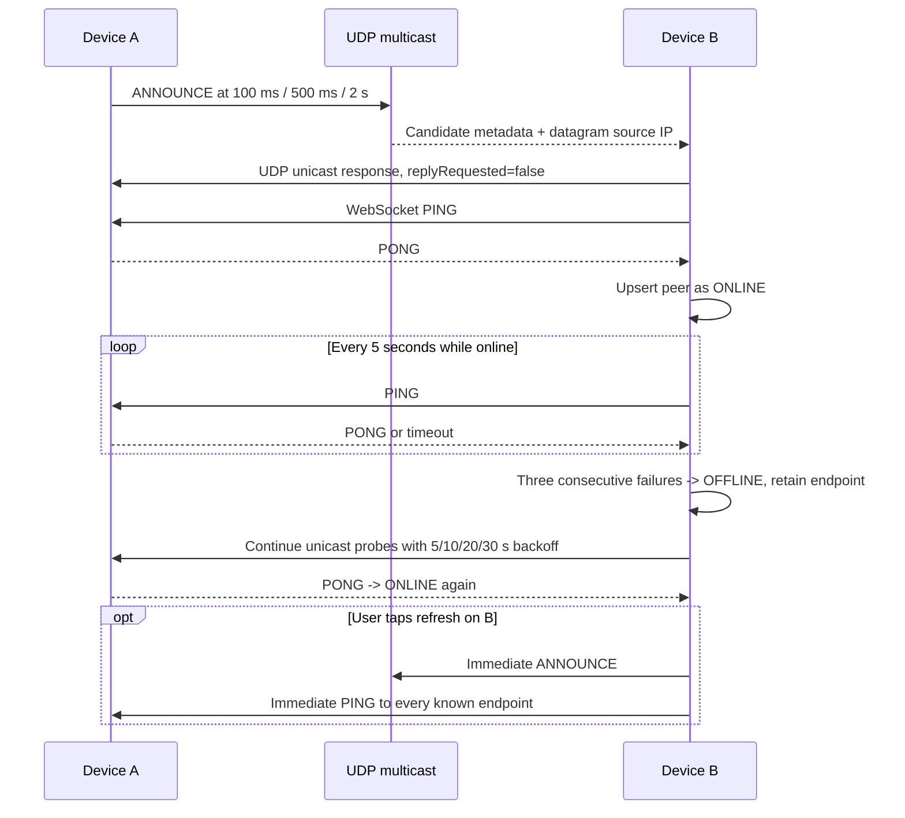
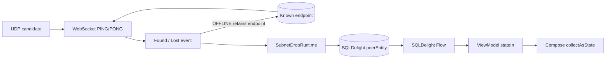

# 局域网发现原理

SubnetDrop 使用主动 UDP 组播公告寻找同一广播域内的候选设备，再用 Ktor WebSocket `PING/PONG` 确认可达性。
发现解决的是“当前去哪里连接”，不是“这个设备是谁”。地址与端口会变化，稳定身份由后续配对阶段的
`deviceId` 和公钥确定。

## 发现报文

UDP 使用组播地址 `224.0.0.167` 和端口 `45893`；聊天与文件仍使用 TCP `45892`。公告是不超过 2 KiB 的严格
JSON，只包含可公开的最小信息：

| 字段 | 含义 | 信任等级 |
|---|---|---|
| `protocolVersion` | 协议主版本，当前为 `1` | 仅用于兼容性过滤 |
| `deviceId` | 候选设备声明的稳定 ID | 不可信，配对后再绑定公钥 |
| `displayName` | 对方声明的显示名称 | 不可信，仅用于 UI |
| `servicePort` | 对方的 TCP/WebSocket 监听端口 | 必须主动探测 |
| `replyRequested` | 是否需要接收方单播回应 | 防止响应循环 |

私钥、信任状态、聊天内容和文件信息都不能进入发现广播。

## 发现流程



应用启动时会立即并发探测数据库中保存的地址，不必等待组播；组播公告每 30 秒低频重复，以修复丢包和网络变化。
数据库端点和曾经确认过的端点在离线后仍保留为单播探测目标，失败重试按 5、10、20、30 秒退避并封顶；新的
UDP 公告仍会绕过退避立即探测。离线只代表当前不可达，不删除端点、历史或信任；因此首次启动竞态、VPN 切换或
偶发组播丢包恢复后，不需要再次收到组播也能回到在线。再次确认同一 `deviceId` 时更新临时 `host`、`port`、
名称和 `lastSeenAt`。未验证的新地址探测失败不会累计到最后确认地址的失败次数，防止伪造公告让真实端点掉线。
全 `/24` 网段扫描尚未启用，避免在无对端时无条件发起 255 个连接；后续只应作为组播失败时的显式兜底。

“附近设备”页右下角刷新按钮会立即发送一次组播公告，同时绕过心跳与离线退避时间，主动探测内存中保存的全部
已知端点。它只触发一轮发现，不停止和重建 Socket、不重启聊天服务、不清空 SQLDelight 设备列表；已经进行中的
同设备探测仍由 in-flight 集合去重，避免连续点击制造并发探测风暴。

## 平台实现

```kotlin
interface PeerDiscovery {
    val events: Flow<DiscoveryEvent>
    suspend fun start(
        localDeviceId: String,
        displayName: String,
        servicePort: Int,
        knownPeers: List<Peer>,
    )
    suspend fun refresh()
    suspend fun stop()
}
```

| 平台 | 实现 | 特殊处理 |
|---|---|---|
| Android | 共享 `UdpPeerDiscovery` | 获取 multicast lock，排除 VPN 网卡，并在发现会话期间把进程绑定到 IPv4 Wi-Fi `Network` |
| macOS / Windows | 共享 `UdpPeerDiscovery` | 排除 point-to-point、虚拟和常见隧道网卡，只在真实 IPv4 LAN 网卡绑定组播 Socket |

候选设备通过 `PeerReachabilityProbe` 调用现有 Ktor 传输层。PONG 只证明该地址上的 SubnetDrop 实例当前可达，
不建立信任；配对仍必须核对安全码。PING 路径只读取轻量设备资料，不触发密码学身份生成。

Android 的绑定覆盖发现会话中新创建的 Socket，因此 UDP 回应、WebSocket 探测以及后续聊天/文件连接不会跟随
VPN 默认路由。停止发现时恢复启动前的进程网络；没有可用 IPv4 Wi-Fi、系统拒绝绑定或绑定目标已经失效时，
实现安全退回系统默认路由，不伪装成绑定成功。这里使用同步网络快照，是为了在打开第一个发现 Socket 前完成绑定，
避免异步网络回调晚于启动流程。

## 数据流与 StateFlow



数据库是设备状态唯一数据源。Repository 暴露冷 `Flow<List<Peer>>`，ViewModel 用 `stateIn` 转为只读
`StateFlow`；网络层不维护一份供 UI 直接读取的平行设备列表。

## 与 LocalSend 的关系

本方案参考 [LocalSend Protocol v2.2](https://github.com/localsend/protocol/blob/main/README.md) 的“UDP 主动公告、
单播确认、已知地址优先”思路，以及其 [组播突发重试实现](https://github.com/localsend/localsend/blob/main/packages/core/src/multicast/mod.rs)。
SubnetDrop 没有照搬文件投递语义：它复用已有 `/chat` WebSocket 做确认，并增加持续心跳，因为聊天联系人在线状态
需要比一次文件发送扫描更长的生命周期。

## 网络边界

UDP 组播通常不能跨越路由器广播域、访客网络隔离或企业 VLAN。普通 VPN 仅修改默认路由时，SubnetDrop 会继续
使用真实局域网接口；两台设备不需要连接同一个 VPN 出口。但应用不能越过操作系统或 VPN 产品明确设置的封锁，
以下情况仍需调整网络设置：

- Wi-Fi 开启 AP/client isolation；
- VPN 开启 kill switch、lockdown 或“禁止访问本地网络”；此时应在 VPN 设置中启用“允许局域网访问”；
- 操作系统防火墙拒绝 UDP `45893` 或 TCP `45892`；
- 桌面系统路由或安全软件强制所有 Socket 进入隧道；
- 设备休眠或应用停止服务发布。

发现结果必须始终按不可信输入校验。攻击者可以伪造名称、ID、地址或版本，因此任何高价值操作都必须在
[配对与端到端加密](end-to-end-encryption.md)之后进行。
