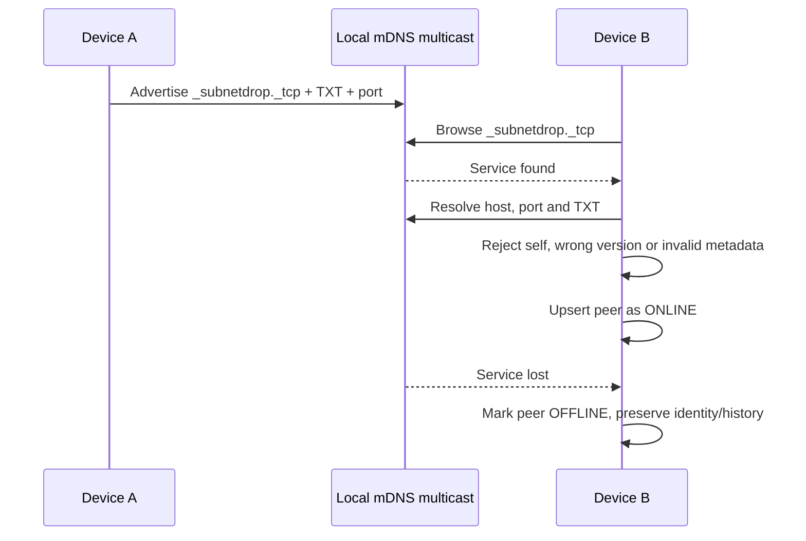

# 局域网发现原理

SubnetDrop 使用 mDNS/DNS-SD 在同一广播域内发布和发现服务。它解决的是“当前去哪里连接”，不是“这个设备
是谁”。地址与端口会变化，稳定身份由后续配对阶段的 `deviceId` 和公钥确定。

## 服务记录

逻辑服务类型是 `_subnetdrop._tcp.local.`，默认 TCP 端口为 `45892`。广播只包含可公开的最小信息：

| TXT 字段 | 含义 | 信任等级 |
|---|---|---|
| `id` | 候选设备的稳定 ID | 不可信，配对后再绑定公钥 |
| `name` | 对方声明的显示名称 | 不可信，仅用于 UI |
| `v` | 协议主版本，当前为 `1` | 用于兼容性过滤 |

私钥、信任状态、聊天内容和文件信息都不能进入发现广播。

## 发现流程



服务消失只代表当前不可达，不删除历史和信任。再次发现同一 `deviceId` 时更新临时 `host`、`port`、名称和
`lastSeenAt`。

## 平台实现

```kotlin
interface PeerDiscovery {
    val events: Flow<DiscoveryEvent>
    suspend fun start(localDeviceId: String, displayName: String, servicePort: Int)
    suspend fun stop()
}
```

| 平台 | 实现 | 特殊处理 |
|---|---|---|
| Android | `NsdManager` | 获取 Wi-Fi multicast lock；重复 resolve 去重；每次解析使用独立 listener |
| macOS / Windows | JmDNS | 注册并监听 `_subnetdrop._tcp.local.`；解析超时为 3 秒 |

common 代码只消费 `Found`、`Lost`、`Failure` 事件，不感知 NSD 或 JmDNS API。

## 网络边界

mDNS 通常不能跨越路由器广播域、访客网络隔离或企业 VLAN。以下情况并非协议 bug：

- Wi-Fi 开启 AP/client isolation；
- VPN 或安全软件拦截本地多播；
- 操作系统防火墙拒绝 mDNS 或 TCP `45892`；
- 多网卡选择了不可达地址；
- 设备休眠或应用停止服务发布。

发现结果必须始终按不可信输入校验。攻击者可以伪造名称、ID、地址或版本，因此任何高价值操作都必须在
[配对与端到端加密](end-to-end-encryption.md)之后进行。
