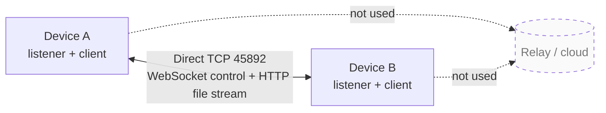
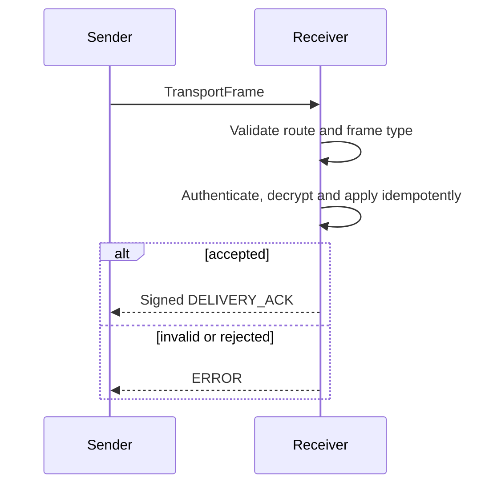

# 点对点传输原理

SubnetDrop 的 P2P 是局域网内的直接连接：每个客户端都启动 Ktor CIO WebSocket 服务端，也能作为客户端连接
另一台设备。没有协调服务器、上传中转或云端消息队列。

## 拓扑定义



这不是互联网级 P2P：当前没有 NAT 穿透、DHT、打洞、中继或离线投递。两端必须能通过发现到的局域网地址直接
访问彼此。

## 连接生命周期

- 聊天、配对和短控制请求使用短生命周期的 request/response WebSocket 会话。
- 设备发现和在线心跳复用短生命周期 `PING/PONG`；1.5 秒探测超时，连续 3 次失败才判定离线。
- 一个已接受的文件使用一个控制 WebSocket 和一个独立 HTTP/1.1 上传请求；接收端通过控制连接异步上报落盘进度，
  文件正文不会为了等待进度确认而停顿。
- 每个请求都有超时和帧大小限制；收到协议错误会显式失败，不把异常吞成默认成功。
- 应用停止时关闭 listener、取消会话并把已发现 peer 标记为离线。

WebSocket 与 HTTP 都使用局域网明文 TCP。聊天正文由应用层 HPKE 加密，文件内容则为追求吞吐的明文流；同网
观察者可能读取文件与 HTTP 头。一次性 Token 和 Ed25519 请求签名负责上传授权，最终摘要负责完整性，但不提供
文件机密性。

## 协议外层

```kotlin
data class TransportFrame(
    val protocolVersion: Int,
    val type: FrameType,
    val senderId: String,
    val recipientId: String,
    val payload: String,
    val signature: String?,
)
```

传输帧协议版本 2 的帧类型包括：

| 类别 | 帧类型 |
|---|---|
| 配对 | `PAIR_REQUEST`, `PAIR_RESPONSE` |
| 聊天 | `CHAT_MESSAGE`, `DELIVERY_ACK`, `READ_RECEIPT` |
| 文件 | `FILE_OFFER`, `FILE_DECISION`, `FILE_STREAM_START`, `FILE_STREAM_PROGRESS`, `FILE_STREAM_COMPLETE`, `FILE_CANCEL` |
| 连接控制 | `ERROR`, `PING`, `PONG` |

接收端先检查版本、帧大小、标识符、收件人和允许的状态转换，再解析类型负载。业务数据不能仅因为来源 IP 与已知
设备相同就被信任。

## 请求与确认



ACK 是应用层确认，不等价于 TCP 写入成功。发送方只有在验证受信接收方签名、确认 ACK 对应当前消息或 transfer
后，才推进本地状态。

## 当前取舍

短连接降低了长期连接状态复杂度，也便于 request/response 测试；代价是聊天消息会重复建立连接。未来若改为
持久双工连接，必须保留相同的身份校验、幂等语义、超时和失败显性化，且通过协议版本处理兼容性。
