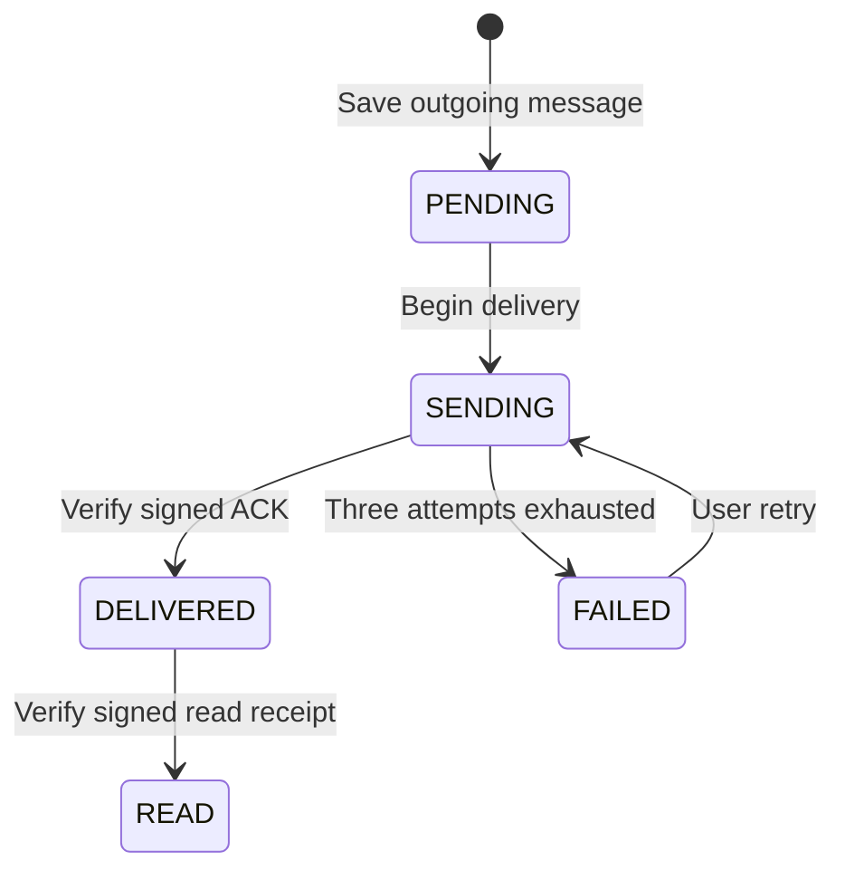
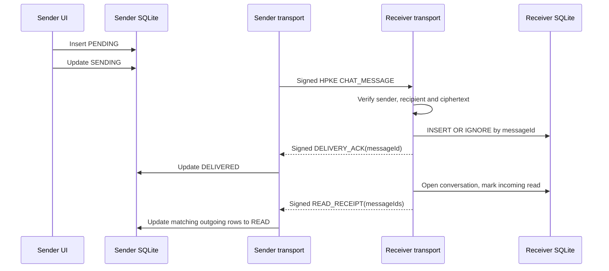

# 可靠消息与本地存储原理

SubnetDrop 没有云端消息队列，所以可靠性由“先本地落库、可重试发送、接收端幂等、签名 ACK、签名已读回执”
共同实现。SQLite 是本地聊天状态的事实来源，Compose UI 观察 Flow 更新。

## 发送状态机



领域模型保留 `SENT` 状态，但当前发送路径在验证 ACK 后直接进入 `DELIVERED`。发送最多尝试 3 次，失败间隔为
300 ms 和 1,000 ms；失败会显式记录为 `FAILED`，不会假装成功。

## 消息流程



`messageId` 是跨重试不变的幂等键，数据库主键与 `INSERT OR IGNORE` 保证相同消息不会产生多行。发送方只接受
来自该消息受信接收者的 ACK；已读回执最多包含 128 个不重复 ID，并且只能更新发给该 peer 的 outgoing 消息。

## 领域接口

```kotlin
interface ChatRepository {
    fun observeConversations(): Flow<List<Conversation>>
    fun observeMessages(conversationId: String): Flow<List<Message>>
    fun observeFileMessages(conversationId: String): Flow<List<FileTransfer>>
    suspend fun saveMessage(message: Message)
    suspend fun saveFileMessage(transfer: FileTransfer)
    suspend fun updateMessageStatus(messageId: String, status: DeliveryStatus)
    suspend fun markConversationRead(conversationId: String)
    suspend fun markOutgoingMessagesRead(peerId: String, messageIds: List<String>)
    suspend fun containsMessage(messageId: String): Boolean
}
```

UI 和用例依赖接口，不直接拼 SQL。SQLDelight 适配器负责查询、类型转换和事务边界。

## 本地数据模型

| 表 | 持久内容 |
|---|---|
| `deviceProfileEntity` | 本机稳定设备 ID 与显示名称 |
| `peerEntity` | 已发现设备、当前地址、在线状态、信任状态和列表隐藏标记 |
| `trustedIdentityEntity` | 经确认的远端 HPKE/Ed25519 公钥和确认时间 |
| `conversationEntity` | 一对一会话与最后更新时间 |
| `messageEntity` | 正文、方向、送达状态和本地已读标记 |
| `fileMessageEntity` | 文件元数据、收发方向、终态、本地路径和失败原因 |

会话 ID 由双方设备 ID 确定，消息按 `createdAt` 与 ID 排序。打开会话会把 incoming 行标为已读并清除未读数；
只有网络回执验证成功后，远端 outgoing 行才变成 `READ`。

## 忘记设备

设备删除属于 peer 聚合的事务操作。始终删除 `trustedIdentityEntity` 并把目标从发现跟踪器移除；不删除历史时，
`peerEntity` 保留为隐藏、离线且未配对，以继续满足 conversation 外键。设备再次公告后，正常 upsert 会清除隐藏标记，
但必须重新核对安全码。

选择同时删除历史时，事务按文字消息、文件消息、conversation、peer 的顺序显式删除，不依赖各平台是否默认启用
SQLite foreign keys。文件消息中的路径只是记录，已经保存到磁盘的实体文件不会被删除。SQLDelight 查询失效会让
Compose 观察的 Flow/StateFlow 自动刷新，无需 UI 手工维护第二份设备列表。

## 存储边界

- 身份、受信公钥、会话、文字消息和终态文件消息跨进程重启保留。
- 私钥不属于数据库 schema，由平台安全存储负责。
- 活跃文件进度只存在应用会话内；完成、拒绝、取消和失败的文件消息会保存到 SQLite。完成消息同时保存发送源路径
  或接收最终路径，UI 使用 FileKit 判断文件是否仍存在；不存在时显示“已失效”，但不修改数据库中的传输终态。
- `messageEntity.body` 当前是明文。未来静态加密需要定义本地数据密钥、密钥轮换、搜索/预览策略和 schema
  迁移，不能只在字段外临时包一层编码。
- 修改 SQLDelight schema 时必须提供迁移并测试已有数据库升级，不能仅验证全新安装。
